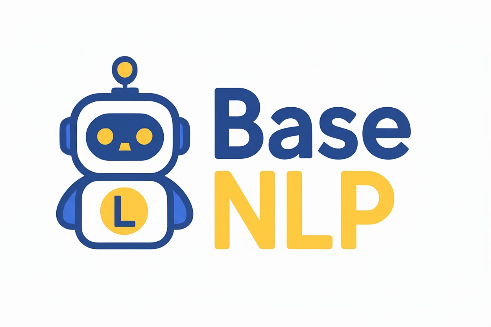

  

  <h2>深入浅出NLP</h2>

  
  
  

  
  

> **注意：本项目当前未完成暂不接受 Pull Request。**
> 如果您有任何建议或发现任何问题，欢迎通过 [Issue](https://github.com/datawhalechina/base-nlp/issues) 进行反馈。

## 项目简介

本项目旨在为NLP学习者提供一条从理论入门到动手实战的学习路径。教程内容分为三大核心部分：理论篇与实战篇。

在**理论篇**中，我们将系统介绍NLP的基础概念、核心技术（如词向量、循环神经网络、注意力机制与Transformer等），为学习者构建坚实的知识体系。**实战篇**则将引导学习者应用所学知识解决真实世界的NLP任务。。。未完待续

## 项目受众

本教程适合以下人群：
- 对自然语言处理感兴趣，并希望系统学习相关技术的学生、开发者和研究人员。
- 希望从零开始构建NLP知识体系的AI算法工程师。

**前置要求：**
- 熟练掌握 Python 编程。
- 具备 PyTorch 使用基础。
- 了解基本的深度学习概念（如神经网络、梯度下降等）。

## 内容大纲

### 第一部分：理论篇
- **第1章：NLP概述**
    - [x] [NLP简介](./docs/chapter1/01_nlp_intro.md)
- **第2章：文本表示与词向量**
    - [x] [文本分词](./docs/chapter2/03_tokenization.md)
    - [x] [词向量](./docs/chapter2/04_word_vector.md)
    - [x] [Word2Vec](./docs/chapter2/05_Word2Vec.md)
    - [x] [Gensim实战](./docs/chapter2/06_gensim.md)
- **第3章：循环神经网络**
    - [x] [RNN](./docs/chapter3/08_RNN.md)
    - [x] [LSTM & GRU](./docs/chapter3/09_LSTM&GRU.md)
- **第4章：注意力机制与Transformer**
    - [x] [Seq2Seq](./docs/chapter4/10_seq2seq.md)
    - [x] [Attention](./docs/chapter4/11_attention.md)
    - [x] [Transformer](./docs/chapter4/12_transformer.md)
- **第5章：**
    - [x] [Bert](./docs/chapter5/13_.md)

### 第二部分：实战篇
- **第1章：命名实体识别**
    - [ ] 
- **第2章：**

### 第三部分：

## 致谢

**核心贡献者**
- [尹大吕-项目负责人](https://github.com/FutureUnreal)（项目发起人与主要贡献者）

## 参与贡献
- 发现问题请提交 Issue。

## Star History

  
如果这个项目对你有帮助，请给我们一个 ⭐️

  
让更多人发现这个项目（护食？发来！）

## 关注我们

扫描下方二维码关注公众号：Datawhale

## 许可证

 本作品采用<a rel="license" href="http://creativecommons.org/licenses/by-nc-sa/4.0/">知识共享署名-非商业性使用-相同方式共享 4.0 国际许可协议</a>进行许可。
