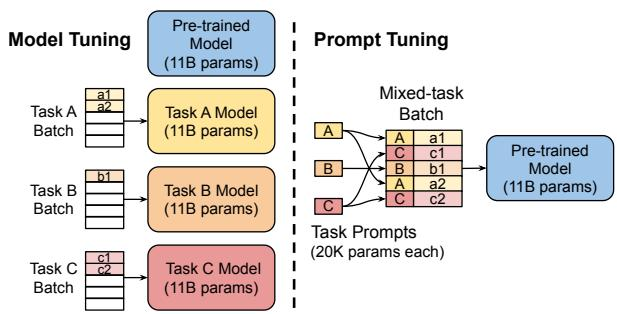

# 第一节 参数高效微调 (PEFT) 技术综述

## 一、大模型时代的“微调”困境

自 BERT 模型发布以来，“预训练-微调”（Pre-train and Fine-tune）的范式在自然语言处理领域取得了巨大成功。不过，当模型参数规模从 BERT 的数亿级别跃升至 GPT-3 的千亿级别时，传统的全量微调（Full Fine-Tuning）遇到了挑战：

- **高昂的训练成本**：微调一个千亿参数的大模型需要巨大的计算资源（数百 GB 的显存）和时间成本，这对于绝大多数开发者和企业来说是遥不可及的。
- **巨大的存储压力**：如果为每一个下游任务都保存一份完整的、千亿级别的模型副本，将导致难以承受的存储开销。
- **灾难性遗忘**：在针对特定任务进行微调时，模型很可能会“忘记”在预训练阶段学到的海量通用知识，损害其泛化能力。
- **训练不稳定性**：大模型的网络结构“又宽又深”，其训练过程对学习率等超参数极为敏感，很容易出现梯度消失/爆炸等问题，导致训练失败。

面对这些困境，研究者们迫切需要一种新的范式，既能有效利用大模型的强大能力，又能避免全量微调带来的高昂成本。

### 1.1 “提示”范式的兴起与局限

2020 年 GPT-3 论文带来了一种全新的、无需训练的范式——**In-Context Learning**。[^1] 研究者们惊喜地发现，在不调整任何模型参数的情况下，仅通过在输入中提供一些任务示例（即**提示 Prompt**），就能引导大模型完成特定任务。这一发现迅速催生了“提示工程”（Prompt Engineering）的繁荣。用户通过组合各种关键词、权重和特殊符号，像“炼金术士”一样探索和“召唤”AI 的强大能力。这种人工设计的、离散的文本指令，我们称之为“硬提示”（Hard Prompt）。

然而，“硬提示”这种“刀耕火种”式的方法存在明显的局限性：
- **设计困难**：找到最优的提示词往往需要大量的试错和经验，过程繁琐且不稳定，充满了“玄学”。
- **性能瓶颈**：离散的文本提示在表达能力上存在上限，难以充分激发和精确控制大模型的潜力。
- **可迁移性差**：在一个模型上精心设计的提示，换到另一个模型或另一种语言上，效果可能大打折扣。

### 1.2 参数高效微调的诞生

如何找到一种既能有效利用大模型能力，又不必承受全量微调高昂成本的方法？学术界和工业界开始探索一种全新的方法：**参数高效微调（Parameter-Efficient Fine-Tuning, PEFT）**。

> **核心思想**：**冻结（freeze）** 预训练模型 99% 以上的参数，仅调整其中极小一部分（通常<1%）的参数，或者增加一些额外的“小参数”，从而以极低的成本让模型适应下游任务。

PEFT 的思想借鉴了计算机视觉领域的迁移学习（Transfer Learning）。在 CV 任务中，我们通常会冻结预训练模型（如 ResNet）负责提取通用特征的卷积层，仅微调后面的全连接层来适应新的分类任务。PEFT 将这一思想应用于 Transformer 架构，并发展出多条技术路线。

## 二、PEFT 技术发展脉络

### 2.1 Adapter Tuning

`Adapter Tuning` 是 PEFT 领域的开创性工作之一，由 Google 在 2019 年为 BERT 模型设计。[^2] 其思路是在 Transformer 的每个块中**插入**小型的“适配器”（Adapter）模块。

  
   
  <em>图 12-1：Adapter Tuning 结构</em>

如图 12-1 所示，左侧的 Transformer 层展示了 Adapter 模块是如何被集成进去的：它被插入到每个子层（注意力层和前馈网络）的内部，并与主干网络形成残差连接。在训练时，只有 Adapter 模块的参数会被更新。

图的右侧展示了 Adapter 模块自身的结构：
1.  一个“降维”的全连接层（Feedforward down-project），将高维特征映射到低维空间。
2.  一个非线性激活函数（Nonlinearity）。
3.  一个“升维”的全连接层（Feedforward up-project），再将特征映射回原始维度。
4.  一个贯穿该模块的**残差连接**，将模块的输出与原始输入相加，保证信息流的稳定。

通过这种“瓶颈式”的结构，Adapter 模块可以用极少的参数量来模拟特定任务的知识。这种方法不仅参数效率高、训练稳定，而且性能上能接近全量微调。但是由于在模型内部添加了新模块，训练时依然需要加载完整模型并计算其前向传播，因此对显存的优化有限，使其难以应用于像 GPT-3 这样的超大模型。

### 2.2 Prefix Tuning

2021 年，斯坦福大学的研究者提出了 `Prefix Tuning`，为 PEFT 开辟了一条全新的思路。[^3] 与 Adapter 在模型内部“动手术”不同，Prefix Tuning 选择**在模型外部做文章**，就像是给模型带上了一张“小抄”。

  
   
  <em>图 12-2：Prefix Tuning 注解示例</em>

图 12-2 是一个注解示例，它揭示了 Prefix Tuning 的工作细节。该图分别展示了 Prefix Tuning 在自回归语言模型（上）和编码器-解码器模型（下）中的应用。其核心机制在于：
- **前缀激活值 (Prefix Activations)**：图中 `PREFIX` 部分对应的激活值 $h_i$ (其中 $i \in \mathsf{P}_{\mathrm{idx}}$) 是从一个专门的可训练矩阵 $P_{\theta}$ 中提取的，这部分参数就是微调的对象。
- **模型计算的激活值**: 而原始输入 $x$ 和输出 $y$ 对应的激活值，则是由**冻结**的 Transformer 模型正常计算得出的。

通过这种方式，模型在不改变原有参数的情况下，学会利用这些可控的“前缀”来引导后续内容的生成，从而适应新的任务。

为了达到更好的效果，Prefix Tuning 不仅在输入层添加前缀，还在 Transformer 的**每一层**都添加了对应的可学习 Prefix，并通过一个小型的前馈网络（MLP）来生成这些参数。

> - **优点**：
>   - **较高的参数效率**：仅优化极少数 Prefix 参数，无需改动原模型。
>   - **显存友好**：由于不改变原模型结构，训练时无需为原模型存储优化器状态，显著降低了显存开销，使得微调千亿级模型成为可能。
>   - **通用性强**：在自回归模型（如 GPT-2）和编解码模型（如 T5/BART）上均取得了不错的效果。
> - **缺点**：
>   - **训练不稳定**：直接优化 Prefix 向量比微调 Adapter 更困难，对超参数和初始化较为敏感。
>   - **占用上下文长度**：Prefix 本身会占用一部分宝贵的上下文窗口，可能影响长文本任务的处理。

### 2.3 Prompt Tuning

`Prefix Tuning` 虽然强大，但其复杂的训练过程和在每一层都添加参数的设计，在实践中不够便捷。同年，Google 提出了 `Prompt Tuning`，可以看作是 Prefix Tuning 的一个**简化版**。[^4] 这种方法也被称为一种“软提示”。

它的做法是：只在输入的 **Embedding 层**添加可学习的虚拟 Token（称为 **Soft Prompt**），而不再干预 Transformer 的任何中间层。

  
   
  <em>图 12-3：Model Tuning 与 Prompt Tuning 对比</em>

图 12-3 直观地展示了 `Prompt Tuning` 这种简化思路在实践中所带来的巨大差异，它不仅是参数效率的提升，更在使用范式上迈出了新的一步。

-   **左侧：全量微调 (Model Tuning)**
    -   作为性能基准，这种方法遵循“一个任务，一个模型”的模式。
    -   **过程**：针对每一个下游任务（Task A, B, C），都需要用其专属的数据集，对庞大的预训练模型（图中为 110 亿参数）进行完整的微调。
    -   **结果**：最终会得到 N 个与原模型同样大小的任务专属模型副本，导致巨大的存储和部署开销。

-   **右侧：提示微调**
    -   它将 PEFT 的效率思想发挥得更加充分，将任务知识完全“外置”到一个轻量级的提示（Prompt）中。
    -   **过程**：其最显著的进步是支持**混合任务批处理 (Mixed-task Batch)**。来自不同任务的数据（如 a1, c1, b1）可以被一同送入模型进行训练，只需在各自数据前拼接对应的任务提示（Task Prompts A, C, B）即可。这在 `Adapter Tuning` 等方法中是难以实现的。
    -   **结果**：训练对象只是微型的任务提示（每个约 2 万参数），而大模型（11B 参数）始终**冻结**并被所有任务共享。最终产出的是几个极小的提示文件，而非庞大的模型副本。这种非侵入式的方法实现起来极为简单，达到了最高的参数和存储效率，为实现单一模型服务多种下游任务提供了可能。

此外，这篇论文最重要的发现是**模型规模的缩放效应（The Power of Scale）**。

  
   
  <em>图 12-4：Prompt Tuning 性能与模型规模的关系</em>

如图 12-4 所示，实验表明：
- 当模型规模较小（如 1 亿参数）时，Prompt Tuning 的效果（绿线）远不如传统的模型微调（红线和橙线）。
- **但当模型规模超过 100 亿时，Prompt Tuning 的性能开始追平甚至超越全量微调！**

这个发现意味着，只要模型“足够大”，我们就不再需要复杂的、侵入式的微调技术，仅仅通过学习一个微型的 Soft Prompt，就能让大模型涌现出强大的任务适应能力。然而，这也揭示了 Prompt Tuning 的局限：它的成功**强依赖于模型的规模**，在中小型模型上效果不佳。

## 三、P-Tuning 系列

在 Prompt Tuning 和 Prefix Tuning 引领潮流的同时，由清华大学团队主导的 P-Tuning 系列工作，针对它们的不足之处进行了深入优化，并最终发展成为一种效果更强、更通用的 PEFT 技术。

### 3.1 P-Tuning v1

P-Tuning v1 的核心动机与 Prompt Tuning 类似：**解决人工设计 Prompt 的不稳定性问题**。[^5] 论文指出，提示中一个词的改变可能导致性能大幅下降。为了解决这个问题，P-Tuning v1 提出，不应该在离散的文本空间搜索最优 Prompt，而应该在连续的 Embedding 空间进行优化，实现一种可微的虚拟提示。

  
   
  <em>图 5：P-Tuning v1 使用一个 Prompt Encoder (如 LSTM) 来生成可学习的虚拟 Token。</em>

它的核心设计是：
1.  **引入可学习的虚拟 Token**：与 Prompt Tuning 类似，引入一些虚拟 Token 作为模板的一部分。
2.  **Prompt Encoder**：使用一个小型（但可微的）神经网络，如 LSTM，来对这些虚拟 Token 进行编码，以捕捉它们之间的相互依赖关系，并生成最终的、连续的 Prompt Embedding。
3.  **融入大模型**：将生成的 Prompt Embedding 与真实的输入文本 Embedding 拼接起来，一起送入大模型进行训练。

通过这种方式，寻找最优 Prompt 的过程从“人工试错”变为了“梯度下降”，实现了提示的自动化构建。

> **与 Prompt Tuning 的关键区别**：
> Prompt Tuning 是直接在 Embedding 矩阵中为虚拟 Token 增加可学习的参数。而 P-Tuning v1 则是通过一个额外的 `Prompt Encoder` 网络来生成这些虚拟 Token 的 Embedding。
>
> **局限性**：
> - **模型规模依赖**：与 Prompt Tuning 类似，在中小型模型上效果不佳。
> - **任务通用性不足**：对于一些复杂的自然语言理解（NLU）任务，特别是序列标注任务，效果有限。

### 3.2 P-Tuning v2

2021 年底，P-Tuning v2 问世，它在 V1 的基础上博采众长，特别是借鉴了 Prefix Tuning 的思想，旨在解决 V1 的局限性，成为一种**在不同模型规模、不同任务上都表现出色**的通用 PEFT 方案，真正走向了通用与高效。[^6]

  
   
  <em>图 6：P-Tuning v2 将软提示（图中橙色部分）应用到了模型的每一层。</em>

P-Tuning v2 的核心改进在于**“深层提示”（Deep Prompt Tuning）**：
- 它移除了 V1 中那个略显笨重的 Prompt Encoder (LSTM)。
- 转而像 Prefix Tuning 一样，**在 Transformer 的每一层都添加可学习的 Prompt Token**。

这带来了几个显著的好处：
1.  **更多的可学习参数**：参数量虽然依旧很少（0.1% ~ 3%），但比 V1 和 Prompt Tuning 要多，为模型提供了更多可供任务适配的“抓手”。
2.  **更强的模型影响**：通过在深层网络中注入提示，P-Tuning v2 可以在模型进行特征提取的各个阶段施加影响，这对于那些需要复杂理解的 NLU 任务至关重要。
3.  **稳定性与通用性**：实验证明，P-Tuning v2 在各种规模的模型（从 3 亿到 100 亿）上都能稳定地达到甚至超越全量微调的效果，彻底摆脱了对“超大杯”模型的依赖。

> 为了更好地区分 `P-Tuning` 和 `Prompt Tuning`，可以设想这样一个场景：
> - **P-Tuning** 就像一位**技艺精湛但遵循古法的大厨（大模型本身）**。你（用户）可能只想描述一种“家乡的味道”（任务指令），大厨一开始无法理解。但通过几次沟通和尝试（微调），这位大厨主动学习并掌握了这种新风味，更新了自己的味觉记忆和菜单（Embedding 层被优化）。**P-Tuning v2 则像是这位大厨去环球美食之旅深度进修了**，不仅掌握了你的家乡菜，还能触类旁通，应对更复杂多样的风味需求（更复杂的任务）。
> - **Prompt Tuning** 则更像一位**情商极高的“美食顾问”（外部小模型）**。他不去改变大厨（冻结的大模型）的任何习惯，而是充当了你和大厨之间的沟通桥梁。他倾听你对“家乡味道”的描述，然后迅速调配出一份完美的秘制酱料（Soft Prompt），并递给大厨说：“按标准流程，加入这个酱料即可。” 厨师本身未变，但这份“酱料”让他的作品精准地满足了你的个性化需求。

## 四、技术对比与总结

| 技术方法 | 核心思想 | 可训练参数量 | 显存占用 | 性能 | 优点 | 缺点 |
| :--- | :--- | :--- | :--- | :--- | :--- | :--- |
| **全量微调** | 训练所有参数 | 100% | 巨大 | 强 (Baseline) | 效果上限高 | 成本高昂，存储巨大，易遗忘 |
| **Adapter Tuning** | 插入小型适配器模块 | 少 (~3.6%) | 较大 | 接近全量微调 | 稳定，性能好 | 侵入式，仍需加载全模型 |
| **Prefix Tuning** | 在每层添加可学习前缀 | 极少 (~0.1%) | 较小 | 接近/超越全量 | 显存友好，效果好 | 训练不稳定，占用上下文 |
| **Prompt Tuning** | 仅在输入层加软提示 | 最少 (<0.01%) | 最小 | 依赖大模型规模 | 极简，存储高效，非侵入式 | 依赖模型规模，小模型无效 |
| **P-Tuning v1** | 用 Prompt Encoder 生成软提示 | 少 (~0.1%) | 较小 | 依赖大模型规模 | 自动化提示，效果优于 PT | 结构略复杂，任务通用性不足 |
| **P-Tuning v2** | 深层提示，每层都加软提示 | 少 (0.1%~3%) | 较小 | 接近/超越全量 | 通用性强，不依赖模型规模 | - |
| **LoRA** | 注入低秩分解矩阵 | 少 (~0.1%) | 较小 | 接近全量微调 | 易实现，生态好，效果好 | - |

> **注**：LoRA（Low-Rank Adaptation）是与上述技术并行的另一条重要技术路线，它通过对权重矩阵进行低秩分解来实现高效微调，因其实现简单、效果出色，目前已成为社区最主流的 PEFT 方法之一。[^7]

## 五、写在最后

从 Adapter Tuning 的巧妙插入，到 Prefix/Prompt Tuning 的非侵入式引导，再到 LoRA 的低秩适应，PEFT 技术的发展深刻地体现了“化繁为简”的工程智慧。它将大模型的微调从一项需要庞大算力和高超技巧的“重工业”，转变为一种轻量、灵活、人人皆可尝试的“轻工业”。

它不仅极大地降低了大模型的使用门槛，也为我们探索大模型能力的边界提供了更灵活、更高效的钥匙。

---

## 参考文献

[^1]: [Brown, T. B., Mann, B., Ryder, N., et al. (2020). *Language Models are Few-Shot Learners*. Advances in Neural Information Processing Systems, 33.](https://proceedings.neurips.cc/paper/2020/hash/1457c0d6bfcb4967418bfb8ac142f64a-Abstract.html)

[^2]: [Houlsby, N., Giurgiu, A., Jastrzebski, S., et al. (2019). *Parameter-Efficient Transfer Learning for NLP*. Proceedings of the 36th International Conference on Machine Learning.](https://proceedings.mlr.press/v97/houlsby19a.html)

[^3]: [Li, X. L., & Liang, P. (2021). *Prefix-Tuning: Optimizing Continuous Prompts for Generation*. Proceedings of the 59th Annual Meeting of the Association for Computational Linguistics.](https://aclanthology.org/2021.acl-long.353/)

[^4]: [Lester, B., Al-Rfou, R., & Constant, N. (2021). *The Power of Scale for Parameter-Efficient Prompt Tuning*. Proceedings of the 2021 Conference on Empirical Methods in Natural Language Processing.](https://aclanthology.org/2021.emnlp-main.243/)

[^5]: [Liu, X., Zheng, Y., Du, Z., et al. (2021). *GPT Understands, Too*. arXiv preprint arXiv:2103.10385.](https://arxiv.org/abs/2103.10385)

[^6]: [Liu, X., Ji, K., Fu, Y., et al. (2021). *P-Tuning v2: Prompt Tuning Can Be Comparable to Fine-tuning Universally Across Scales and Tasks*. arXiv preprint arXiv:2110.07602.](https://arxiv.org/abs/2110.07602)

[^7]: [Hu, E. J., Shen, Y., Wallis, P., et al. (2021). *LoRA: Low-Rank Adaptation of Large Language Models*. International Conference on Learning Representations.](https://arxiv.org/abs/2106.09685)