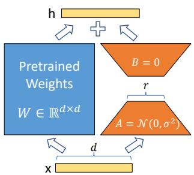
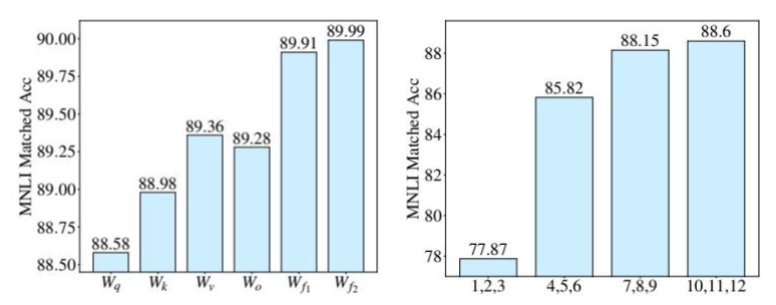
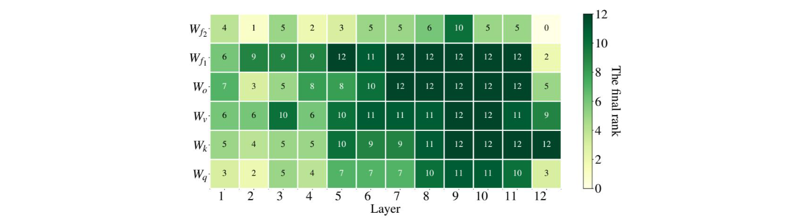

# 第二节 LoRA 方法详解

在上一节中，我们探讨了以 Adapter 和各类 Prompt Tuning 为代表的 PEFT 技术。它们通过在模型中 **插入** 新的模块或在输入端 **添加** 可学习的提示，巧妙地实现了高效微调。这些方法的核心，都是在尽量不“打扰”原始模型权重的前提下，通过影响模型的 **激活值** 来适应新任务。

本节，我们将介绍一种另辟蹊径，也是当前社区应用最广泛的 PEFT 方法——**LoRA（Low-Rank Adaptation of Large Language Models）**。它不再“绕道而行”，而是直击模型的“心脏”——**权重矩阵**，并提出一个深刻的洞见：大模型的参数更新，或许并不需要那么“兴师动众”。

## 一、低秩近似的核心思想

全量微调之所以成本高昂，是因为它需要为模型中每一个权重矩阵 $W$（维度可能高达数万）计算并存储一个同样大小的更新矩阵 $ΔW$。为了解决这个问题，研究者们提出了像 Adapter Tuning 和 Prompt Tuning 这样的参数高效微调方法。但是，它们也存在一些未解决的痛点：Adapter 虽好，却会引入额外的**推理延迟**；Prompt Tuning 则会**占用输入序列长度**，且优化难度较高。

有没有一种方法，既能大幅减少参数，又不引入推理延迟，还能直接作用于模型权重呢？这就是 LoRA 试图回答的问题。它的提出，源于一个关键假设：[^1]

> **大语言模型是过参数化的（Over-parametrized），它们在针对特定任务进行微调时，权重更新矩阵 $ΔW$ 具有一个很低的“内在秩”（Intrinsic Rank）。**

这意味着，尽管 $ΔW$ 的维度很高，但它所包含的“有效信息”实际上可以被一个远小于其规模的低秩矩阵来表示。基于此，LoRA 的核心思想就是用两个更小的“低秩”矩阵 $A$ 和 $B$ 的乘积，来模拟（近似）这个庞大的更新矩阵 $ΔW$。

$$ \Delta W = B \cdot A $$

其中，$W_0 \in \mathbb{R}^{d \times k}$，低秩分解后的 $B \in \mathbb{R}^{d \times r}$，$A \in \mathbb{R}^{r \times k}$，而秩 $r \ll \min(d, k)$。

  
   
  <em>图 12-7：LoRA 结构示意图</em>

如图 12-7 所示，LoRA 的工作方式可以理解为在原始的预训练权重 $W_0$ 旁边，增加了一个并行的“旁路”结构，计算分为两条路径：
1. **主路**：输入 $x$ 经过原始的、被**冻结**的预训练权重 $W_0$。
2. **旁路**：输入 $x$ 依次通过两个低秩矩阵 $A$ 和 $B$。矩阵 $A$ 先将维度从 $d$ "压缩" 到一个很小的秩 $r$，然后再由矩阵 $B$ "解压"回维度 $d$。

最终的输出 $h$ 是这两条路径结果的加和：

$$ h = W_0 \cdot x + \Delta W \cdot x = W_0 \cdot x + (B \cdot A) \cdot x $$

在训练时，只有旁路的矩阵 $A$ 和 $B$ 会被更新。通过这种方式，需要优化的参数量就从 $d \times k$ 急剧下降到了 $d \times r + r \times k$。通常，秩 $r$ 会选择一个非常小的值（如 8, 16, 64），使得可训练参数量仅为全量微调的千分之一甚至万分之一。

> **初始化与缩放技巧**
>
> - **初始化**：如上图所示，旁路矩阵有特殊的初始化方式。矩阵 A 通常使用高斯分布进行随机初始化（$A = \mathcal{N}(0, \sigma^2)$），而矩阵 B 则初始化为全零（$B=0$）。这样做可以确保在训练开始时，旁路输出为零，微调是从原始的预训练模型状态开始的，保证了训练初期的稳定性。
> - **缩放**：LoRA 的前向计算公式会包含一个缩放因子 $s$：$h = W_0 \cdot x + s \cdot (B \cdot A) \cdot x$。这个 $s$ 通常设为 $\alpha/r$，其中 $\alpha$ 是一个可调超参。这个缩放操作有助于在调整秩 $r$ 时，减少对学习率等其他超参数的重新调整需求，让训练过程更稳定。

## 二、LoRA 的优势与实践

相比于之前介绍的 PEFT 方法，LoRA 以其独特的结构带来了显著的优势。

### 2.1 核心优势

LoRA 凭借其独特的并行结构和直接作用于权重的特性，展现出几大核心优势：
- **更高的参数与存储效率**：对于每一个下游任务，我们不再需要存储一个完整的模型副本，而只需保存极小的矩阵 A 和 B。论文指出，这可以将模型 checkpoints 的体积缩小高达 **10,000 倍**（例如从 350GB 减小到 35MB）。在训练时，由于无需为冻结的参数计算梯度和存储优化器状态，可以节省高达 **2/3 的 GPU 显存**，并提升约 **25% 的训练速度**。
- **零额外推理延迟**：这是 LoRA 相比 Adapter Tuning 最具吸引力的优点。Adapter 在模型中串行地引入了新的计算层，不可避免地会增加推理延迟。而 LoRA 的旁路结构在训练完成后，可以通过矩阵加法 $(W' = W_0 + s \cdot B \cdot A)$ 直接“合并”回原始权重中。这样，模型的网络结构与原始模型完全一致，不会引入任何额外的计算步骤。
    > **注**：这种“合并”策略的代价是，如果你需要为**不同的任务**（拥有不同的 LoRA 权重）同时提供服务，在单个批次（batch）中混合处理这些任务会变得不那么直接。
- **效果媲美全量微调，且不占用输入长度**：与 Prompt-Tuning 等作用于输入激活值的方法不同，LoRA 直接修改权重矩阵，能更深入、更直接地影响模型的行为，其效果也更接近于全量微调。同时，它不添加任何 virtual token，不会占用宝贵的上下文长度，在处理长文本任务时更具优势。
- **良好的可组合性**：LoRA 的设计是**正交的**，它可以与 Prefix-Tuning 等其他 PEFT 方法结合使用，取长补短，进一步提升模型性能。

### 2.2 关键实践

LoRA 虽然强大，但也带来了新的超参数选择问题：应该对哪些权重矩阵应用 LoRA？秩 $r$ 又该如何选择？幸运的是，原始论文通过大量实验为我们提供了清晰的指导。

第一个问题是：**应该对哪些权重矩阵应用 LoRA？**

<table border=1 style='margin: auto; width: max-content;'><tr><td style='text-align: center;'></td><td colspan="7" style='text-align: center;'># of Trainable Parameters = 18M</td></tr><tr><td style='text-align: center;'>Weight Type</td><td style='text-align: center;'>Wq</td><td style='text-align: center;'>Wk</td><td style='text-align: center;'>Wv</td><td style='text-align: center;'>Wo</td><td style='text-align: center;'>Wq, Wk</td><td style='text-align: center;'>Wq, Wv</td><td style='text-align: center;'>Wq, Wk, Wv, Wo</td></tr><tr><td style='text-align: center;'>Rank <i>r</i></td><td style='text-align: center;'>8</td><td style='text-align: center;'>8</td><td style='text-align: center;'>8</td><td style='text-align: center;'>8</td><td style='text-align: center;'>4</td><td style='text-align: center;'>4</td><td style='text-align: center;'>2</td></tr><tr><td style='text-align: center;'>WikiSQL (&plusmn;0.5%)</td><td style='text-align: center;'>70.4</td><td style='text-align: center;'>70.0</td><td style='text-align: center;'>73.0</td><td style='text-align: center;'>73.2</td><td style='text-align: center;'>71.4</td><td style='text-align: center;'>73.7</td><td style='text-align: center;'>73.7</td></tr><tr><td style='text-align: center;'>MultiNLI (&plusmn;0.1%)</td><td style='text-align: center;'>91.0</td><td style='text-align: center;'>90.8</td><td style='text-align: center;'>91.0</td><td style='text-align: center;'>91.3</td><td style='text-align: center;'>91.3</td><td style='text-align: center;'>91.3</td><td style='text-align: center;'>91.7</td></tr></table>
 
<em>表 12-1：不同注意力权重上的 LoRA 微调效果（来源：LoRA 原始论文 Table 5）</em>

通过 **表 12-1** 的数据可以看出，那就是应当**优先选择注意力权重**。在固定的可训练参数预算下，将 LoRA 应用于更多的权重类型（特别是 Wq 和 Wv 的组合）比增大单一权重类型的秩能带来更好的性能。因此，一个高效的策略是**仅在注意力模块中应用 LoRA，并冻结其他模块（如前馈网络 FFN）的参数**。

第二个问题是：**秩 r 的选择是不是越大越好？**

<table border=1 style='margin: auto; width: max-content;'><tr><td style='text-align: center;'></td><td style='text-align: center;'>Weight Type</td><td style='text-align: center;'>r=1</td><td style='text-align: center;'>r=2</td><td style='text-align: center;'>r=4</td><td style='text-align: center;'>r=8</td><td style='text-align: center;'>r=64</td></tr><tr><td rowspan="3">WikiSQL(&plusmn;0.5%)</td><td style='text-align: center;'>Wq</td><td style='text-align: center;'>68.8</td><td style='text-align: center;'>69.6</td><td style='text-align: center;'>70.5</td><td style='text-align: center;'>70.4</td><td style='text-align: center;'>70.0</td></tr><tr><td style='text-align: center;'>Wq, Wv</td><td style='text-align: center;'>73.4</td><td style='text-align: center;'>73.3</td><td style='text-align: center;'>73.7</td><td style='text-align: center;'>73.8</td><td style='text-align: center;'>73.5</td></tr><tr><td style='text-align: center;'>Wq, Wk, Wv, Wo</td><td style='text-align: center;'>74.1</td><td style='text-align: center;'>73.7</td><td style='text-align: center;'>74.0</td><td style='text-align: center;'>74.0</td><td style='text-align: center;'>73.9</td></tr><tr><td rowspan="3">MultiNLI (&plusmn;0.1%)</td><td style='text-align: center;'>Wq</td><td style='text-align: center;'>90.7</td><td style='text-align: center;'>90.9</td><td style='text-align: center;'>91.1</td><td style='text-align: center;'>90.7</td><td style='text-align: center;'>90.7</td></tr><tr><td style='text-align: center;'>Wq, Wv</td><td style='text-align: center;'>91.3</td><td style='text-align: center;'>91.4</td><td style='text-align: center;'>91.3</td><td style='text-align: center;'>91.6</td><td style='text-align: center;'>91.4</td></tr><tr><td style='text-align: center;'>Wq, Wk, Wv, Wo</td><td style='text-align: center;'>91.2</td><td style='text-align: center;'>91.7</td><td style='text-align: center;'>91.7</td><td style='text-align: center;'>91.5</td><td style='text-align: center;'>91.4</td></tr></table>
 
<em>表 12-2：不同秩 r 对 LoRA 微调效果的影响（来源：LoRA 原始论文 Table 6）</em>

**表 12-2** 的实验结果颠覆了传统直觉，证明了“小即是美”的观点。我们可以看到，一个非常小的秩 <i>r</i>（例如 4, 8 甚至 1）就已经足够强大，盲目增大 <i>r</i> 不仅会增加参数量，有时甚至会导致性能下降。例如，对于 Wq 和 Wv 的组合，即使秩 <i>r</i> 仅为 1 或 2，模型在各项任务上的表现也已具竞争力，甚至超过了 <i>r</i>=64 的情况。这证明了权重更新确实是低秩的。

最后一个问题是，**LoRA 究竟是如何生效的？** 论文通过分析发现，它学习到的更新矩阵 $\Delta W$ 并不是对原始权重 $W_0$ 中最重要特征的简单复制，恰恰相反，它学习到了那些 **在预训练中学习到但未被充分强调、却对下游任务至关重要的“隐藏特征”，并对其进行大幅放大**。它不是在重复模型已经很擅长的事情，而是在“查缺补漏”，精准地增强了模型在特定任务上所欠缺的能力。

## 三、AdaLoRA 自适应微调

尽管上述实践为我们提供了指导，但 LoRA 仍然引入了新的“玄学”：
- **秩 $r$ 的选择**：$r$ 应该设为多大？这是一个固定的超参数，无法在训练中自适应调整。
- **微调目标的选择**：应该对哪些权重矩阵（$W_q, W_k, W_v, W_o$ 还是前馈网络 FFN 的矩阵）应用 LoRA？原始 LoRA 论文的实验主要集中在注意力模块，忽略了 FFN 模块，但后续研究发现 FFN 的微调同样至关重要。

实验表明，为所有矩阵和所有层级设置一个统一的、固定的秩 $r$，远非最优解。不同任务、不同模型层、不同权重矩阵，其“可塑性”和对任务的重要性是不同的，它们理应被区别对待。手动去探索这个巨大的超参组合空间几乎是不可能的。

  
   
  <em>图 12-8：不同模块与层级的微调性能对比</em>

如图 12-8 所示，原始论文的实验清晰地展示了这种差异：在固定的参数预算下，微调前馈网络（FFN）模块的性能优于注意力模块，同时，微调模型更高层级的权重也比微调底层能带来更大的收益。

为了解决这个问题，AdaLoRA (Adaptive LoRA) [^2] 提出了一种更智能的、自适应的 LoRA 方案，思路是：**根据权重的重要性，动态地、有选择地为不同模块分配参数预算**。AdaLoRA 不再使用固定的秩 $r$，而是让模型在训练过程中自己“决定”哪些部分更需要被微调，以及需要多大的“力度”（秩）去微调。这一过程主要包含三个关键创新。

### 3.1 基于 SVD 的参数化

AdaLoRA 的第一步，是对 LoRA 的低秩分解形式进行了巧妙的改进。它不是使用两个简单的矩阵 $B \cdot A$，而是引入了经典的 **奇异值分解 (SVD)** 思想来参数化更新矩阵 $\Delta W$：

$$
\Delta W = P \Lambda Q
$$

在经典的机器学习和信号处理中，SVD 是一种强大的矩阵分解技术，能将任意矩阵分解为三个矩阵的乘积：一个左奇异向量矩阵 $P$、一个对角矩阵 $\Lambda$ 和一个右奇异向量矩阵 $Q$。其中，对角线上的奇异值代表了数据中最重要的主成分。AdaLoRA 正是借鉴了这一思想。

这种参数化方式有两大好处：
1. **避免了高昂的计算成本**：它只是在形式上 **模拟** 了 SVD，在训练时 $P, \Lambda, Q$ 都是可训练的参数，并不需要对 $\Delta W$ 进行真正的、计算开销极大的 SVD 分解。
2. **结构化的重要性**：这种分解将 $\Delta W$ 的更新信息解耦为三个部分：$P$ 和 $Q$ 决定了更新的“方向”，而 $\Lambda$ 中的奇异值 $\lambda_i$ 则决定了在对应方向上的更新“幅度”。这使得我们可以通过调整奇异值的大小来直接控制每个“更新分量”的重要性，也即调整矩阵的秩。

为确保 $P$ 和 $Q$ 在训练中保持正交性（这是奇异向量的性质），AdaLoRA 还在训练损失中加入了一个 **正交正则化项**，以保证分解的稳定性和有效性。

### 3.2 重要性评分与动态预算分配

有了 SVD 这种分解结构，AdaLoRA 接下来要解决的问题是：**如何衡量每个“更新分量”的重要性？**

它将每个奇异值和其对应的左右奇异向量组合成一个“**三元组**”（triplet） $\mathcal{G}_{k,i} = \{P_{k,*i}, \lambda_{k,i}, Q_{k,i*}\}$。在训练过程中，AdaLoRA 会为每个三元组计算一个重要性分数 $S_{k,i}$。这个分数是基于对三元组中每个参数 $w$ 的重要性 $s(w)$ 进行聚合得到的。

参数 $w$ 的重要性 $s(w)$ 又由两部分相乘得到：平滑后的**参数敏感度 (Sensitivity)** $\bar{I}(w)$ 和**不确定性 (Uncertainty)** $\bar{U}(w)$。

- **参数敏感度 `I`**：它被定义为参数自身大小与其梯度的乘积的绝对值，即 $I(w) = |w \cdot \nabla_w \mathcal{L}|$。其直观含义是：如果将这个参数 $w$ 置零，模型损失会发生多大的变化。敏感度越高，说明该参数对当前任务的性能影响越大。
- **平滑与不确定性 `U`**：由于训练是分批次（mini-batch）进行的，单个批次计算出的梯度具有随机性，导致敏感度 `I` 的值会剧烈波动。为了得到更稳定的评估，AdaLoRA 引入了**指数移动平均 (EMA)** 来对敏感度和不确定性进行平滑处理：

    $$
    \bar{I}^{(t)}(w) = \beta_1 \bar{I}^{(t-1)}(w) + (1-\beta_1)I^{(t)}(w)
    $$
    $$
    \bar{U}^{(t)}(w) = \beta_2 \bar{U}^{(t-1)}(w) + (1-\beta_2)|I^{(t)}(w) - \bar{I}^{(t)}(w)|
    $$

    其中，$\bar{I}^{(t)}$ 是平滑后的敏感度，而 $\bar{U}^{(t)}$ 则量化了瞬时敏感度与平滑后值的偏差，即“不确定性”。一个参数如果不仅敏感度高，而且这种敏感性在训练中持续稳定出现（即不确定性低），那么它就更重要。

最终，单个三元组的重要性分数 $S_{k,i}$ 由其内部所有参数的重要性聚合而成：

$$
S_{k,i} = s(\lambda_{k,i}) + \frac{1}{d_1}\sum_{j=1}^{d_1}s(P_{k,ji}) + \frac{1}{d_2}\sum_{j=1}^{d_2}s(Q_{k,ij})
$$

在计算出所有三元组的重要性分数后，AdaLoRA 会进行排序，并根据一个预设的**参数预算（总秩）**，**裁剪**掉那些得分最低的三元组（即将它们对应的奇异值 $\lambda_i$ 置为 0），从而实现了参数的动态分配。

### 3.3 全局预算调度器与目标函数

为了让训练过程更加稳定和高效，AdaLoRA 的整体**目标函数** `L` 包含了原始的损失函数 `C` 和我们前面提到的正交正则项 `R`：

$$
\mathcal{L}(\mathcal{P},\mathcal{E},\mathcal{Q}) = \mathcal{C}(\mathcal{P},\mathcal{E},\mathcal{Q}) + \gamma \sum_{k=1}^n R(P_k,Q_k)
$$

同时，它还引入了**全局预算调度器 (Global Budget Scheduler)** 的策略。这里的“预算” $b(t)$，指的就是在训练的第 $t$ 步，模型总共保留的奇异值的数量。它由一个分段函数精确控制：

$$
b^{(t)} = \begin{cases}
b^{(0)} & 0 \le t < t_i \\
b^{(T)} + (b^{(0)} - b^{(T)})\left(1 - \frac{t - t_i}{T - t_i - t_f}\right)^3 & t_i \le t < T-t_f \\
b^{(T)} & \text{otherwise}
\end{cases}
$$

这个调度策略包含三个阶段：
1. **热身阶段 ($0 \le t < t_i$)**：从一个比目标预算 $b^{(T)}$ 略高的初始预算 $b^{(0)}$ 开始训练，让模型有更充分的机会去“探索”所有参数的潜在重要性。
2. **裁剪阶段 ($t_i \le t < T-t_f$)**：按照一个**三次方的调度曲线**，逐步地裁剪掉重要性分数较低的奇异值，将预算平滑地降低到最终的目标值。
3. **微调阶段**：在预算分配基本稳定后，固定预算为 $b^{(T)}$（即锁定了最重要的参数），继续对模型进行微调直至收敛。

这种“先探索、后收敛”的策略，让模型有更充分的机会去发现哪些权重真正重要，从而做出更优的预算分配决策。最终，AdaLoRA 实现了在训练过程中对秩的**动态调整**和在不同模块间的**智能分配**。

  
   
  <em>图 12-9：AdaLoRA 最终秩分配结果示意图</em>

图 12-9 直观地展示了 AdaLoRA 的最终分配结果。可以看到，模型自动为 FFN 模块（ $W_{f1}, W_{f2}$ ）以及模型的高层（层级 6-12）分配了更高的秩（颜色更深），这与图 12-8 的实验观察完全吻合，证明了其自适应机制的有效性。

> **与 Adapter、SVD 主题模型及剪枝的联系**
> 
> AdaLoRA 的设计，与我们之前介绍过的多个概念都有着深刻的渊源：
> - **与 Adapter Tuning**：两者都采用了“高维 → 低维 → 高维”的瓶颈结构。但 Adapter 是作用于 **激活值** 的 **串行** 模块（增加推理延迟），而 LoRA/AdaLoRA 是作用于 **权重** 的 **并行** 支路（可合并，无额外延迟）。AdaLoRA 在结构上更高效。
> - **与 SVD 主题模型**：SVD 在主题模型中被用于分解“词-文档”矩阵，以发现最重要的“**语义主题**”（数据层面的低秩近似）。而 AdaLoRA 则创造性地将 SVD 的思想用于分解“**权重更新矩阵**”，以找到最关键的“**参数变化方向**”（模型层面的低秩近似）。
> - **与 LoRA 剪枝**：一种直接的思路是，我们能否直接对 LoRA 的 $(B,A)$ 矩阵对进行剪枝？例如，将不重要的某一对 $(B_{*i}, A_{i*})$ 整个置零。论文通过实验对比证明，AdaLoRA 的 SVD 结构更优越。因为即使某个奇异值 $\lambda_i$ 被置零，其对应的奇异向量 $P_{\ast i}$ 和 $Q_{i*}$ 仍然被保留和更新，这为后续“复活”这个分量提供了可能。而直接剪枝 LoRA 的矩阵对则是一种更“永久”的破坏，缺乏这种灵活性，也更容易导致训练不稳定。

论文的实验结果也表明，AdaLoRA 的自适应机制是有效的。它能自动发现**前馈网络 (FFN)** 和**模型顶层**的权重矩阵更为重要，并为其分配更高的秩。此外，消融实验证明，**即使不使用动态预算分配，仅仅将参数化形式从 $B \cdot A$ 替换为 $P \Lambda Q$，就已经能带来性能提升**，说明了 SVD 结构本身的优越性。

这种自适应的机制，使得 AdaLoRA 在相同的参数预算下，往往能达到比原始 LoRA 更好的性能，进一步提升了参数高效微调的水平。

## 四、小结

---

## 参考文献

[^1]: [Hu, E. J., Shen, Y., Wallis, P., et al. (2021). *LoRA: Low-Rank Adaptation of Large Language Models*. arXiv preprint arXiv:2106.09685.](https://arxiv.org/abs/2106.09685)

[^2]: [Zhang, Q., Chen, Y., Zha, D., et al. (2023). *Adaptive Budget Allocation for Parameter-Efficient Fine-Tuning*. Proceedings of the International Conference on Learning Representations (ICLR).](https://arxiv.org/abs/2303.10512)
