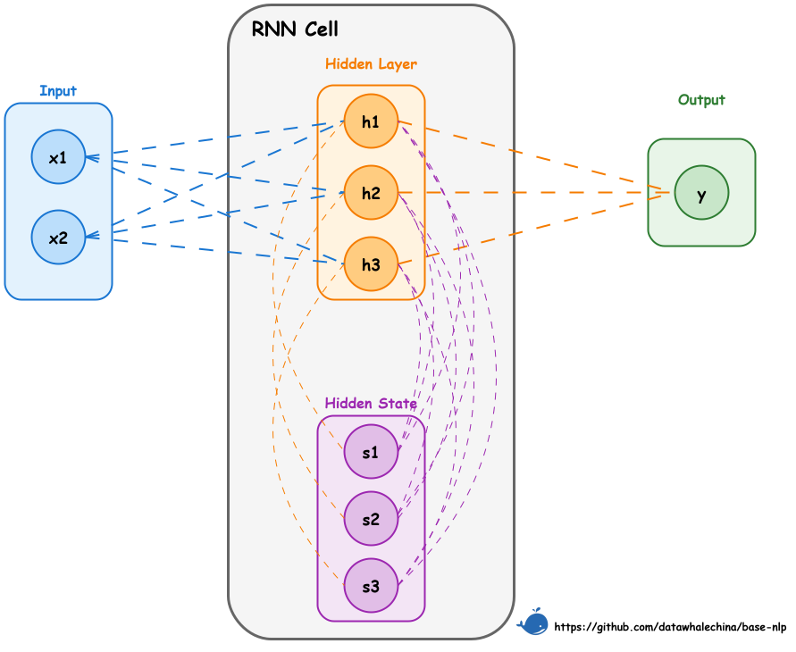

# 第一节 循环神经网络

## 一、如何处理序列信息？

我们已经学习了如何将文本进行分词，并通过词嵌入技术（如 Word2Vec）将每个独立的词元（Token）转换成一个静态的、稠密的词向量。这解决了模型输入的第一个问题：将文本数值化。

> 第二个关键问题：**如何从一个词向量序列中，有效地提取整个序列的特征？**

例如，对于一个意图识别任务，需要将指令 **“播放周杰伦的《稻香》”** 归类到 **“音乐播放”**。目前已经能得到“播放”、“周杰伦”、“的”、“《稻香》”这几个词元各自的词向量，但如何将这些向量融合成一个能代表整句指令含义的 **“文本向量”**，并送入分类器呢？

### 1.1 简单方法的局限性

#### 1.1.1 词袋模型：向量求和

一个最直接的想法是，像词袋法一样，直接将所有词向量相加或取平均。

- **问题**：这种方法完全忽略了语序信息。“我爱你” 和 “你爱我” 会得到完全相同的文本向量。更重要的是，它将所有词语视为同等重要。在“播放周杰伦的《稻香》”这句话中，“播放”和“《稻香》”显然比“的”包含更多分类所需的关键信息，但简单的求和无法体现这种差异。

#### 1.1.2 全连接网络

另一个想法是，可以用一个全连接网络（Fully Connected Network, FC）来处理这些词向量。有两种方式：
1.  **先求和，后FC**：这与向量求和没有本质区别，依然丢失了语序和重点信息。
2.  **先FC，后求和**：可以对每一个词向量都进行一次全连接变换，然后再将变换后的向量相加。

为了处理变长的句子，在每个时间步（即每个词元的位置）上使用的全连接层必须 **共享同一套权重参数**。但这依然存在一个致命缺陷：

- **问题**：在计算任意一个词的输出时（如 `《稻香》` 的输出），模型仅仅使用了 `《稻香》` 自己的词向量，完全没有考虑到它前面出现了 “播放”、“周杰伦”、“的” 这些词。每个词元依然是被 **孤立处理** 的，模型无法理解词元之间的顺序关系和上下文依赖，即 **没有捕获序列特征**。

#### 1.1.3 卷积神经网络（CNN）

在图像处理中大获成功的CNN也可以用于文本。通过使用一维卷积核（窗口）滑过整个词向量序列，CNN能够捕捉到词语的局部依赖关系（如n-grams）。

- **问题**：CNN的缺陷在于其 **感受野是固定的**。一个大小为3的卷积核，只能看到附近3个词的关系。虽然可以通过堆叠多层CNN来扩大感受野，但对于句子开头和结尾的长距离依赖，CNN仍然难以有效捕捉。无法预先设定一个适用于所有句子的“最佳”窗口大小。

## 二、RNN 的核心思想：引入“记忆”

为了解决上述问题，需要一种新的网络结构，它必须能够 **记住** 在处理当前词元之前都看过了哪些信息。循环神经网络（Recurrent Neural Network, RNN）应运而生。

> **概念补充：什么是“时间步” (Time Step)？**

> 在处理序列数据（如文本）时，模型按顺序逐个处理序列中的元素（如词元）。**“时间步”** 就是这个处理过程中的一个离散步骤。在文本处理的上下文中，**一个时间步通常对应于处理一个词元**。例如，对于句子“播放周杰伦的歌”，处理“播放”是时间步 1，处理“周杰伦”是时间步 2，以此类推。

RNN 的思路是：在处理序列的每一步时，网络不仅接收当前时间步的输入 $x_t$，还会接收一个来自 **上一步的“记忆”**——即隐藏状态 $h_{t-1}$。网络将这两部分信息融合，生成当前步的输出 $h_t$，然后这个 $h_t$ 又会作为“记忆”传递给下一步。

可以将这个过程看作是对全连接网络的改进：
1.  **当前输入的信息**：和之前一样，用一个全连接层处理当前输入 $x_t$，得到 $U \cdot x_t$。
2.  **过去记忆的信息**：引入另一个全连接层，处理来自上一步的隐藏状态 $h_{t-1}$，得到 $W \cdot h_{t-1}$。
3.  **融合与激活**：将两部分信息相加，并通过一个激活函数（如 $\tanh$），得到当前步的隐藏状态 $h_t$。

如此一来， $h_t$ 就同时包含了当前输入 $x_t$ 的信息和之前所有步的信息摘要 $h_{t-1}$。

### 2.1 RNN 结构

下图展示了 RNN 单元在单个时间步内的计算流程。需要注意，为了可视化，此图将隐藏状态拆分成了两个部分（`Hidden State` 和 `Hidden Layer`），但在计算上它们是紧密关联的。



可以将图中的流程分解如下，并与公式 $h_t = \tanh(U x_t + W h_{t-1} + b)$ 对应起来：

1.  **输入 ($x_t$)**: 左侧的 "Input" 块代表当前时间步的输入向量 $x_t$。它通过权重矩阵 $U$ 连接到隐藏层（图中的蓝色虚线），对应公式中的 $U x_t$ 部分。
2.  **前一时刻的隐藏状态 ($h_{t-1}$)**: 紫色的 "Hidden State" 块（图中用 $s$ 表示）代表了来自**上一个时间步**的记忆，即 $h_{t-1}$。它通过循环权重矩阵 $W$ 连接到隐藏层（图中的橙色虚线），对应公式中的 $W h_{t-1}$ 部分。
3.  **当前时刻的隐藏状态 ($h_t$)**: 橙色的 "Hidden Layer" 块（图中用 $h$ 表示）代表了**当前时间步**计算出的新隐藏状态 $h_t$。它是输入信息和旧状态信息融合并经过激活函数计算后的结果。
4.  **状态更新**: 新计算出的隐藏状态 $h_t$ 将作为“记忆”传递给下一个时间步，成为下一个时间步计算中的 $h_{t-1}$（图中从 "Hidden Layer" 指向 "Hidden State" 的紫色虚线）。
5.  **输出 ($o_t$)**: 当前的隐藏状态 $h_t$ 也可以被用来计算当前步的最终输出（如图中从 "Hidden Layer" 指向 "Output" 的橙色虚线），这通常需要再经过一个独立的输出层。

通过这种循环机制，RNN 单元在每个时间步都融合了当前输入和历史记忆，实现了信息的持续传递。

> **关键点**：在所有的时间步中，权重矩阵 $U$（输入到隐藏层）和 $W$（隐藏层到隐藏层）是 **共享** 的。这使得RNN能够处理任意长度的序列，并且极大地减少了模型参数。

## 三、RNN 工作原理解析

### 3.1 文本分类示例

回到最初的例子，看看 RNN 是如何解决 **“播放周杰伦的《稻香》”** 的分类问题的。

**1. 准备输入**

- **分词**：["播放", "周杰伦", "的", "《稻香》"]
- **ID化**：[23, 58, 102, 203] (假设)
- **词嵌入**：得到4个词向量 $x_1, x_2, x_3, x_4$。假设每个向量是128维。输入序列的形状为 $(T, E) = (4, 128)$。

**2. RNN 逐步处理**

RNN 会按顺序处理这个向量序列，并不断更新其内部的“记忆”（隐藏状态 $h$）。假设隐藏状态是64维 ($H=64$)。
- **初始状态**：在处理第一个词之前，隐藏状态 $h_0$ 通常被初始化为零向量。
- **第1步 (t=1)**：
  - 输入：第一个词向量 $x_1$ (“播放”) 和初始隐藏状态 $h_0$。
  - 计算： $h_1 = \tanh(U \cdot x_1 + W \cdot h_0 + b)$
  - $h_1$ 现在包含了“播放”的信息。
- **第2步 (t=2)**：
  - 输入：第二个词向量 $x_2$ (“周杰伦”) 和上一步的隐藏状态 $h_1$。
  - 计算： $h_2 = \tanh(U \cdot x_2 + W \cdot h_1 + b)$
  - $h_2$ 现在融合了“播放”和“周杰伦”的信息。
- **第3步 (t=3)**：
  - 输入：第三个词向量 $x_3$ (“的”) 和 $h_2$。
  - 计算： $h_3 = \tanh(U \cdot x_3 + W \cdot h_2 + b)$
  - $h_3$ 融合了“播放周杰伦的”的信息。
- **第4步 (t=4)**：
  - 输入：第四个词向量 $x_4$ (“《稻香》”) 和 $h_3$。
  - 计算： $h_4 = \tanh(U \cdot x_4 + W \cdot h_3 + b)$
  - $h_4$ 融合了整个句子的信息。

**3. 获取文本向量并分类**

当 RNN 处理完最后一个词元后，得到的最终隐藏状态 $h_4$ 就被认为是整个句子的 **动态上下文表示**，即我们需要的 **“文本向量”**。这个向量捕获了整个句子的语序和语义信息。

最后，我们将这个 $h_4$ 向量送入一个标准的全连接分类层，就可以得到各个类别（如“音乐播放”、“天气查询”）的置信度了。通过这种方式，RNN 成功地将一个变长的词向量序列，编码成了一个蕴含序列信息的固定长度的特征向量。

### 3.2 从静态到动态的飞跃

通过上面的例子，能够发现 RNN 解决了静态词向量的局限性：

-   **静态输入**: RNN的输入 $x_t$ (如“周杰伦”的词向量) 是静态的。无论“周杰伦”出现在哪个句子里，这个从 Word2Vec 等模型中查出来的初始向量都是固定不变的。

-   **动态表示**: RNN的输出——隐藏状态 $h_t$ ——是动态的。
    -   在处理“**播放** 周杰-伦的...”时， $h_t$ 是在包含了“播放”这个上下文信息的基础上生成的。
    -   如果处理另一句话“**我喜欢** 周杰伦...”，那么 $h_t$ 则是在包含了“我喜欢”这个上下文信息的基础上生成的。
    -   因此，同一个词在不同语境下，其对应的RNN隐藏状态是完全不同的。

> RNN 通过其循环结构，将静态的词向量融入了不断演变的上下文信息，从而为序列中的每一个词元都生成了一个独一无二的、动态的、上下文相关的向量表示。这正是 RNN 的价值所在。

## 四、从零实现一个 RNN

为了将理论付诸实践并加深理解，接下来从底层的数学公式出发，用 NumPy 手写一个 RNN。

> [本节完整代码](https://github.com/FutureUnreal/base-nlp/blob/main/code/C3/01_RNN.py)

### 4.1 RNN 公式简化

为了与后续的代码实现保持一致，此处采用一个不含偏置项（bias）的简化版 RNN，其核心计算公式如下：

$$
h_t = \tanh(U x_t + W h_{t-1})
$$

其中， $h_t$ 是当前时刻的隐藏状态， $x_t$ 是当前输入， $h_{t-1}$ 是上一时刻的隐藏状态， $U$ 和 $W$ 是共享的权重矩阵。

### 4.2 数据准备

在实现 RNN 的计算过程之前，首先需要准备输入数据。下面的代码定义了模型的一些基本参数，并实现了 `prepare_inputs` 函数，用以构造一个代表句子 **“播放周杰伦的《稻香》”** 的词向量序列。

```python
import numpy as np

# (B, T, E, H) 分别表示 批次/序列长度/输入维度/隐藏维度
B, E, H = 1, 128, 3

def prepare_inputs():
    """
    使用 NumPy 准备输入数据
    使用示例句子: "播放 周杰伦 的 《稻香》"
    构造最小词表和随机(可复现)词向量, 生成形状为 (B, T, E) 的输入张量。
    """
    np.random.seed(42)
    vocab = {"播放": 0, "周杰伦": 1, "的": 2, "《稻香》": 3}
    tokens = ["播放", "周杰伦", "的", "《稻香》"]
    ids = [vocab[t] for t in tokens]

    # 词向量表: (V, E)
    V = len(vocab)
    emb_table = np.random.randn(V, E).astype(np.float32)

    # 取出序列词向量并加上 batch 维度: (B, T, E)
    x_np = emb_table[ids][None]
    return tokens, x_np
```
这段代码首先定义了一个简单的词表，然后为句子中的每个词生成一个随机的词向量，最终组合成一个形状为 `(1, 4, 128)` 的张量，作为 RNN 模型的输入。依照前文 RNN 的图示结构，将隐藏节点设置为3个 (`H=3`)，以便于理解（实际使用不会这么少）。

### 4.3 基于 NumPy 实现 RNN

```python
def manual_rnn_numpy(x_np, U_np, W_np):
    B_local, T_local, _ = x_np.shape
    # 初始化 h_0 为零向量
    h_prev = np.zeros((B_local, H), dtype=np.float32)
    
    steps = []
    # 按时间步循环
    for t in range(T_local):
        x_t = x_np[:, t, :]
        # 核心公式实现
        h_t = np.tanh(x_t @ U_np + h_prev @ W_np)
        steps.append(h_t)
        h_prev = h_t # 更新状态
        
    return np.stack(steps, axis=1), h_prev
```
这段代码展示了 RNN 的工作原理，将公式 $h_t = \tanh(U x_t + W h_{t-1})$ 转换为了具体的计算步骤：

1.  **初始化**: `h_prev = np.zeros(...)` 创建了一个全零的初始隐藏状态，作为处理**每个序列**开始前的“空白记忆”。

2.  **逐帧处理**: `for t in range(T_local):` 循环遍历序列中的每一个时间步（即每一个词元）。

3.  **核心计算**: 在循环内部，`h_t = np.tanh(x_t @ U_np + h_prev @ W_np)` 这一行完美地复现了 RNN 的核心逻辑：
    -   `x_t @ U_np`：对当前时间步的输入 $x_t$ 进行线性变换。
    -   `h_prev @ W_np`：对上一步的隐藏状态 $h_{t-1}$ 进行线性变换。
    -   将两者相加，再通过 `tanh` 激活函数，就得到了融合了当前输入和过去记忆的新隐藏状态 $h_t$。

4.  **状态更新**: `h_prev = h_t` 实现了“循环”的精髓。当前计算出的 $h_t$ 会作为下一个时间步的 `h_prev`，将信息传递下去。

5.  **结果保存**: `steps.append(h_t)` 将每一步计算出的隐藏状态都保存下来，最终通过 `np.stack` 组合成一个包含所有时间步输出的张量。

### 4.4 PyTorch 的 `nn.RNN` 实现

PyTorch 提供了高度封装的 `nn.RNN` 模块，它内部完成了与我们手写版本完全相同的循环计算，但经过了优化，效率更高。

```python
# 初始化一个与手写版本配置相同的RNN层
rnn = nn.RNN(
    input_size=E,      # 输入维度 E
    hidden_size=H,     # 隐藏状态维度 H (设置为3)
    num_layers=1,      # 单层RNN
    bias=False,        # 不使用偏置项，与手写版对齐
    batch_first=True,  # 输入形状为 (B, T, E)
)

# 将手写版本使用的权重加载到nn.RNN模块中
with torch.no_grad():
    rnn.weight_ih_l0.copy_(U.T) # U
    rnn.weight_hh_l0.copy_(W.T) # W

# 一次性完成所有时间步的计算
output, h_n = rnn(x)
```

### 4.5 `nn.RNN` 核心参数解析

- `input_size` ($E$): 输入特征 $x_t$ 的维度。在NLP中，这通常是词嵌入的维度 `embedding_dim`。
- `hidden_size` ($H$): 隐藏状态 $h_t$ 的维度。这代表了RNN“记忆”的容量，也是其隐藏层的节点数。
- `num_layers`: RNN的层数。默认是1。如果大于1，会构成一个“堆叠RNN”（Stacked RNN），即前一层RNN在所有时间步的输出，会作为后一层RNN的输入。
- `bias`: 是否使用偏置项。默认为 `True`。如果为真，则公式会变为 $h_t = \tanh(U x_t + b_{ih} + W h_{t-1} + b_{hh})$。在示例中设为 `False` 以便与手写版本对齐。
- `batch_first`: 一个非常重要的维度顺序参数。默认为 `False`，此时输入张量的形状应为 `(T, B, E)`。在代码中设为 `True`，使得输入形状为更符合直觉的 `(B, T, E)`，其中 `B`是批次大小，`T`是序列长度。
- `bidirectional`: 是否构建一个双向RNN。默认为 `False`。双向RNN能同时考虑过去和未来的上下文，后续章节将对此进行介绍。

### 4.6 数值对齐验证

`01_RNN.py` 脚本的最后一部分，也是最关键的一步，是验证用NumPy手写的RNN和PyTorch官方的`nn.RNN`模块在给定相同输入和相同权重时，其输出是否完全相同。

```python
# 将NumPy结果转回PyTorch张量
out_manual = torch.from_numpy(out_manual_np)

# 使用 allclose 进行浮点数精度下的严格比较
print("逐步输出一致:", torch.allclose(out_manual, out_torch, atol=1e-6))
# 输出: True
```

得到 `True` 的结果，证明了：
1. 对 RNN 数学原理的理解是正确的。
2. `nn.RNN` 模块内部确实执行了所理解的循环计算过程。

## 五、简单 RNN 的局限性

尽管 RNN 在理论上可以捕捉长距离依赖，但在实践中，它存在一些严重的问题：
1.  **梯度消失与梯度爆炸**：由于信息在时间序列上连乘式地传播，在反向传播过程中，梯度很容易变得过小（梯度消失）或过大（梯度爆炸）。这使得 RNN 很难学习到序列中相距较远的词之间的依赖关系（**长距离依赖问题**）。
2.  **单向性**：基本 RNN 的信息流是单向的， $t$ 时刻的计算只能利用 $t$ 时刻之前的信息，无法利用未来的上下文信息。但在很多 NLP 任务中，一个词的含义同时取决于它的前文和后文。
3.  **近期偏置**：由于梯度消失的影响，RNN 的“记忆”更偏向于序列中较近的输入，对于序列开头的输入信息，可能会在传递过程中逐渐被遗忘。

为了解决这些问题，许多 RNN 的变体被提出，其中两种最为著名的变体便是 **长短期记忆网络（Long Short-Term Memory, LSTM）** 和 **门控循环单元（Gated Recurrent Unit, GRU）**，后续章节将对此进行详细探讨。 