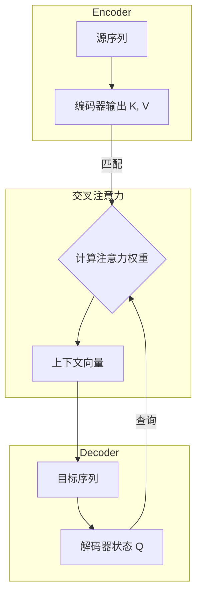
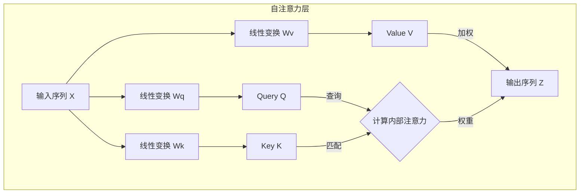

# 第三节 Transformer

注意力机制通过动态加权的方式，克服了传统 Seq2Seq 模型中的“信息瓶颈”问题。然而，这些模型依然依赖于循环神经网络（RNN）来处理序列信息，这意味着它们必须按顺序、一个词元接一个词元地进行计算，这在处理长序列时效率低下，并且存在长距离依赖信息丢失的问题。

2017年，Google 的研究团队发表了一篇名为《Attention Is All You Need》的论文，提出了一种全新的架构——**Transformer** [^1]。这篇论文的标题极具冲击力，其思想也同样具有颠覆性：完全抛弃了 RNN 和卷积网络，整个模型完全基于注意力机制来构建。Transformer 的提出是自然语言处理领域的一个里程碑。它不仅凭借其出色的并行计算能力极大地提升了训练效率，还更有效地捕捉了文本中的长距离依赖关系，为后续的 BERT、GPT 等大规模预训练模型的诞生提供了架构基础。

## 一、自注意力机制 (Self-Attention)

从根本上说，要让模型理解一段文本，就需要提取其“序列特征”，即将文本中所有词元的信息以某种方式整合起来。RNN 通过依次传递隐藏状态来顺序地整合信息，而 Transformer 则选择了一条截然不同的道路。

Transformer 的核心是**自注意力机制 (Self-Attention)**。它不再依赖于顺序计算，而是将提取序列特征的过程看作是输入序列“自己对自己进行注意力计算”。序列中的每个词元都会审视序列中的所有其他词元，来动态地计算出最能代表当前词元上下文含义的新表示。

在上一节的交叉注意力中，Query 来自解码器，而 Key 和 Value 来自编码器，信息在两个不同序列间流动。而在自注意力中，**Query、Key、Value 均来源于同一个输入序列**。

举个例子，在句子“苹果公司发布了新款手机，**它**采用了最新的芯片”中，要理解代词“它”指的是“新款手机”而不是“苹果公司”，模型就需要将“它”与句子中的其他词元进行关联。自注意力机制正是通过计算“它”对句中其他所有词的注意力权重来实现这一点的。

### 1.1 结构对比：自注意力与交叉注意力的区别

从结构上看，自注意力与上一节讨论的传统注意力（即交叉注意力）的关键区别在于**信息的来源和流动方向**。

在传统的 **交叉注意力 (Cross-Attention)** 机制中，信息在两个不同的序列之间流动。通常，**Query** 来自解码器（代表当前的目标序列状态），而 **Key** 和 **Value** 来自编码器的所有输出（代表完整的源序列信息）。其目的是在生成目标序列的每一步时，从源序列中寻找最相关的信息。



而在 **自注意力 (Self-Attention)** 机制中，信息则是在**同一个序列内部**进行流动和重组。它的 **Query, Key, 和 Value 都来自同一个输入序列**。其目的是为了捕捉输入序列内部的依赖关系，重新计算序列中每个词元的表示，使其包含更丰富的上下文信息。



总结来说，尽管底层的加权求和计算方式相似，但两者在架构上的目标完全不同：
-   **交叉注意力**：用于**对齐**和**整合**两个**不同**序列之间的信息。
-   **自注意力**：用于**理解**和**重构**单个序列**内部**的依赖关系。

### 1.2 自注意力的计算过程

自注意力的计算过程与上一节介绍的 QKV 范式完全一致，关键区别在于 Q, K, V 的来源。

1.  **生成 Q, K, V 向量**：

    对于输入序列中的**每一个**词元，首先获取其词嵌入向量 $x_i$。然后，将该向量分别与三个可学习的、在整个模型中共享的权重矩阵 $W^Q, W^K, W^V$ 相乘，生成该词元专属的 Query 向量 $q_i$、Key 向量 $k_i$ 和 Value 向量 $v_i$。

    $$
    q_i = x_i W^Q \\
    k_i = x_i W^K \\
    v_i = x_i W^V
    $$

    这三个矩阵的作用是将原始的词嵌入向量投影到不同的、专门用于注意力计算的表示空间中，赋予了模型更大的灵活性。

2.  **计算注意力分数**：

    为了计算第 $i$ 个词元的新表示，需要用它的 Query 向量 $q_i$ 去和**所有**词元（包括它自己）的 Key 向量 $k_j$ 计算点积，得到注意力分数。

    $$
    \text{score}(i, j) = q_i \cdot k_j
    $$

3.  **缩放与归一化**：
    将得到的分数除以一个缩放因子 $\sqrt{d_k}$（$d_k$ 是 Key 向量的维度），然后通过 Softmax 函数进行归一化，得到最终的注意力权重 $\alpha_{ij}$。这个缩放步骤的目的与上一节中介绍的一致，都是为了在训练过程中保持梯度稳定。当向量维度 $d_k$ 较大时，点积结果的方差会增大，可能将 Softmax 函数推向其梯度极小的区域，从而导致梯度消失，影响模型学习。进行缩放可以有效缓解这个问题。

    $$
    \alpha_{ij} = \text{softmax}\left(\frac{q_i \cdot k_j}{\sqrt{d_k}}\right)
    $$

4.  **加权求和**：
    使用计算出的权重 $\alpha_{ij}$ 对**所有**词元的 Value 向量 $v_j$ 进行加权求和，得到第 $i$ 个词元经过自注意力计算后得到的新表示 $z_i$。

    $$
    z_i = \sum_j \alpha_{ij} v_j
    $$

通过这个过程，输出向量 $z_i$ 不再仅仅包含原始词元 $x_i$ 的信息，而是融合了整个序列中所有与之相关词元的信息，成为一个上下文感知的、更丰富的表示。

### 1.3 矩阵运算与并行化

上述步骤描述的是单个词元 $i$ 的计算过程。在实际应用中，如果采用循环的方式逐个计算每个词元的 $z_i$，效率会非常低下。自注意力的巨大优势在于其**并行计算**能力，这通过将整个过程表达为矩阵运算来实现。

假设整个输入序列的词嵌入矩阵为 $X$（维度为 `[sequence_length, embedding_dim]`），我们可以一次性计算出所有词元的 Q, K, V 矩阵：

$$
Q = X W^Q \\
K = X W^K \\
V = X W^V
$$

然后，整个自注意力的输出矩阵 $Z$ 可以通过一个公式完成计算：

$$
Z = \text{Attention}(Q, K, V) = \text{softmax}\left(\frac{QK^T}{\sqrt{d_k}}\right)V
$$

这个公式与上一节中介绍的通用注意力公式完全相同。这里的核心区别不在于数学运算，而在于**输入的来源**：

-   在上一节的**交叉注意力**中，Q 来自一个序列（解码器），而 K 和 V 来自另一个序列（编码器）。
-   在当前的**自注意力**中，矩阵 Q、K 和 V **全部派生自同一个输入序列 X**。

因此，同一个数学范式，根据输入来源的不同，被用于解决两个不同的问题：一个是两个序列之间的对齐，另一个是单个序列内部的依赖关系建模。

在这个公式中，$QK^T$ 的计算结果是一个维度为 `[sequence_length, sequence_length]` 的注意力分数矩阵，其中第 $i$ 行第 $j$ 列的元素表示第 $i$ 个词元对第 $j$ 个词元的注意力权重。这种基于矩阵运算的方式能够利用现代硬件（如 GPU）的并行计算能力。

### 1.4 PyTorch 实现与代码解析

> [本节完整代码](https://github.com/FutureUnreal/base-nlp/blob/main/code/C4/03_Self-Attention.py)

从概念上讲，自注意力的计算可以分解为对序列中每个词元进行循环操作，这种方式虽然直观但效率极低。因此，现代深度学习框架中的实现都采用了**矩阵运算**的方式。通过将整个序列的 Q, K, V 看作矩阵，利用一次大规模的矩阵乘法，就能并行地完成所有词元之间的相关性计算。

下面是这种高效并行化版本的实现：

```python
class SelfAttention(nn.Module):
    """自注意力模块"""
    def __init__(self, hidden_size):
        super(SelfAttention, self).__init__()
        self.hidden_size = hidden_size
        self.q_linear = nn.Linear(hidden_size, hidden_size)
        self.k_linear = nn.Linear(hidden_size, hidden_size)
        self.v_linear = nn.Linear(hidden_size, hidden_size)
        
    def forward(self, x):
        q = self.q_linear(x)
        k = self.k_linear(x)
        v = self.v_linear(x)
        
        scores = torch.matmul(q, k.transpose(-2, -1)) / math.sqrt(self.hidden_size)
        attention_weights = torch.softmax(scores, dim=-1)
        context = torch.matmul(attention_weights, v)
        
        return context
```

**代码解析**:
- **`__init__`**: 初始化了三个 `nn.Linear` 层，它们分别对应将输入映射到 Q, K, V 空间的权重矩阵 $W^Q, W^K, W^V$。
- **`forward`**:
    1.  `q_linear(x)`, `k_linear(x)`, `v_linear(x)`：将形状为 `[batch_size, seq_len, hidden_size]` 的输入张量 `x` 分别通过三个线性层，一次性地为序列中的所有词元计算出 Q, K, V 矩阵。
    2.  `torch.matmul(q, k.transpose(-2, -1))`: 这是实现并行计算的核心。通过将 K 矩阵的最后两个维度转置（`seq_len, hidden_size` -> `hidden_size, seq_len`），再与 Q 矩阵相乘，直接得到了一个 `[batch_size, seq_len, seq_len]` 的分数矩阵。该矩阵中的 `scores[b, i, j]` 代表了批次 `b` 中第 `i` 个词元对第 `j` 个词元的注意力分数。
    3.  `/ math.sqrt(self.hidden_size)`：执行缩放操作，防止梯度消失。
    4.  `torch.softmax(scores, dim=-1)`：对分数的最后一个维度（`seq_len`）进行 Softmax，得到归一化的注意力权重。
    5.  `torch.matmul(attention_weights, v)`：将权重矩阵与 V 矩阵相乘，完成了对所有词元的 Value 向量的加权求和，得到最终的上下文感知表示。

## 二、多头注意力机制 (Multi-Head Attention)

仅仅用一组 $W^Q, W^K, W^V$ 矩阵进行一次自注意力计算，相当于只从一个“视角”来审视文本内在的关系。然而，文本中的关系是多层次的，例如，一组参数可能学会了关注代词（如 “it” 指向谁）的关系，但可能忽略了动作的执行者（主谓宾）等其他类型的关系。

为了让模型能够综合利用从不同维度和视角提取出的信息，Transformer 引入了**多头注意力机制 (Multi-Head Attention)**。

其核心思想非常直接：并行地执行多次自注意力计算，每一次计算都是一个独立的“头 (Head)”。每个头都拥有一组自己专属的 $W^Q_i, W^K_i, W^V_i$ 权重矩阵，并且可以学习去关注一种特定类型的上下文关系。

具体流程如下：

1.  **并行计算**：假设有 $h$ 个头，那么就初始化 $h$ 组不同的权重矩阵 $(W^Q_0, W^K_0, W^V_0), (W^Q_1, W^K_1, W^V_1), \dots, (W^Q_{h-1}, W^K_{h-1}, W^V_{h-1})$。
2.  **独立注意力**：对于输入序列，每个头都独立地执行一次完整的自注意力计算，产生一个输出矩阵 $Z_i$。
3.  **拼接与投影**：将所有 $h$ 个头的输出矩阵 $Z_0, Z_1, \dots, Z_{h-1}$ 在特征维度上进行**拼接 (Concatenate)**。
4.  **最终输出**：将拼接后的巨大矩阵乘以一个新的权重矩阵 $W^O$，将其投影回原始的输入维度，得到多头注意力机制的最终输出。


多头机制允许模型在不同的表示子空间中共同学习上下文信息。例如，一个头可能专注于捕捉长距离的语法依赖，而另一个头可能更关注局部的词义关联。这种设计极大地增强了模型的表达能力。

在实践中，为了保持计算总量不变，通常会将原始的词嵌入维度 `d_model` 均分给 $h$ 个头。例如，如果 `d_model=512`，有 `h=8` 个头，那么每个头产生的 Q, K, V 向量维度就是 `d_k = d_v = 512 / 8 = 64`。计算时，先将输入 $X$ 分别投影到 $h$ 组低维的 Q, K, V 向量，并行计算后，再将结果拼接并投影回 `d_model` 维度。

### 2.1 PyTorch 实现与代码解析

多头注意力的思想是通过并行运行多个独立的自注意力“头”，并融合它们的输出来增强模型的表达能力。一个低效的实现是简单地创建多个 `SelfAttention` 实例并拼接结果。而高效的实现则是将多个头的计算逻辑合并到一次矩阵运算中。

```python
class MultiHeadSelfAttention(nn.Module):
    """多头自注意力模块"""
    def __init__(self, hidden_size, num_heads):
        super(MultiHeadSelfAttention, self).__init__()
        assert hidden_size % num_heads == 0, "hidden_size 必须能被 num_heads 整除"
        
        self.hidden_size = hidden_size
        self.num_heads = num_heads
        self.head_dim = hidden_size // num_heads
        
        self.q_linear = nn.Linear(hidden_size, hidden_size)
        self.k_linear = nn.Linear(hidden_size, hidden_size)
        self.v_linear = nn.Linear(hidden_size, hidden_size)
        self.wo = nn.Linear(hidden_size, hidden_size)

    def forward(self, x):
        batch_size, seq_len, _ = x.shape
        
        q = self.q_linear(x)
        k = self.k_linear(x)
        v = self.v_linear(x)
        
        # 拆分多头
        q = q.view(batch_size, seq_len, self.num_heads, self.head_dim).transpose(1, 2)
        k = k.view(batch_size, seq_len, self.num_heads, self.head_dim).transpose(1, 2)
        v = v.view(batch_size, seq_len, self.num_heads, self.head_dim).transpose(1, 2)
        
        # 并行计算注意力
        scores = torch.matmul(q, k.transpose(-2, -1)) / math.sqrt(self.head_dim)
        attention_weights = torch.softmax(scores, dim=-1)
        context = torch.matmul(attention_weights, v)
        
        # 合并多头结果
        context = context.transpose(1, 2).contiguous().view(batch_size, seq_len, self.hidden_size)
        
        # 输出层
        output = self.wo(context)
        
        return output
```

**代码解析**:
- **`__init__`**:
    - `head_dim`：计算出每个头的维度，即 `hidden_size / num_heads`。
    - `q_linear, k_linear, v_linear`：与单头类似，但这里的线性层输出维度仍然是 `hidden_size`。这是为了**一次性计算出所有头所需的总特征**。
    - `wo`：对应于多头注意力机制中的输出权重矩阵 $W^O$，用于融合所有头的信息。
- **`forward`**:
    1.  **线性变换**: 与单头版本相同，得到总的 Q, K, V 矩阵。
    2.  **拆分多头**: 这是实现并行化计算的关键技巧。
        -   `.view(batch_size, seq_len, self.num_heads, self.head_dim)`: 首先，将 `hidden_size` 维度逻辑上拆分为 `num_heads` 和 `head_dim` 两个维度。此时张量形状变为 `[batch, seq_len, num_heads, head_dim]`。
        -   `.transpose(1, 2)`: 然后，交换 `seq_len` 和 `num_heads` 维度，得到 `[batch, num_heads, seq_len, head_dim]`。这一步是为了让 `num_heads` 成为一个类似批次 (batch) 的维度，使得后续的矩阵乘法可以在每个头内部独立、并行地进行。
    3.  **并行计算注意力**: `torch.matmul(q, k.transpose(-2, -1))` 现在是一个四维张量的乘法。PyTorch 会自动地将其解释为在第 0 和第 1 维（`batch` 和 `num_heads`）上进行批处理，而对最后两个维度执行矩阵乘法。这样就实现了所有头的注意力分数计算的并行化。
    4.  **合并多头**: 这是拆分操作的逆过程。
        -   `.transpose(1, 2)`: 先将 `num_heads` 和 `seq_len` 维度换回来，形状变为 `[batch, seq_len, num_heads, head_dim]`。
        -   `.contiguous()`: 由于 `transpose` 操作可能导致张量在内存中不是连续存储的，需要调用 `.contiguous()` 来确保内存连续，之后才能安全地使用 `.view()`。
        -   `.view(batch_size, seq_len, self.hidden_size)`: 最后，将 `num_heads` 和 `head_dim` 两个维度重新合并成 `hidden_size` 维度，完成了所有头输出的拼接。
    5.  **输出投影**: 将合并后的结果通过 `wo` 线性层，得到最终输出。

## 三、Transformer 整体架构

理解了自注意力和多头注意力之后，就可以进一步探究 Transformer 的整体架构了。它依然是一个 Encoder-Decoder 结构，但其内部的组成模块是全新的。


### 3.1 编码器 (Encoder)

Transformer 的编码器由 $N$ 个（原论文中 $N=6$）完全相同的层堆叠而成。每一层又包含两个主要的子层：

1.  **多头自注意力层 (Multi-Head Self-Attention Layer)**：
    这一层执行的就是我们刚刚讨论的多头自注意力计算。它负责让输入序列中的每个词元都能关联到序列中的其他词元，从而生成一个上下文感知的表示。

2.  **位置前馈网络 (Position-wise Feed-Forward Network)**：
    这是一个相对简单的全连接前馈网络，它独立地应用于序列中的**每一个位置**。它的作用是对注意力层聚合了上下文信息之后的表示进行一次非线性的变换，以提取更抽象、更丰富的特征。注意力机制本身主要负责信息的“融合”，而前馈网络则提供了“计算”和“转换”的能力，进一步增强了模型的表达能力。它通常由两个线性变换和一个 ReLU 激活函数组成：
    $$
    \text{FFN}(x) = \max(0, xW_1 + b_1)W_2 + b_2
    $$

在每个子层的后面，都连接了一个**残差连接 (Residual Connection)** 和一个**层归一化 (Layer Normalization)** 操作。理论上，网络越深，提取特征的能力应该越强。但在实践中，简单地堆叠层数会导致“模型退化”问题：随着网络加深，原始输入信息在经过大量线性变换和激活函数后会逐渐丢失，导致更深的网络性能反而不如较浅的网络。

残差连接通过创建一个“快捷通道”解决了这个问题。子层的输入 $x$ 会直接“跳过”子层的计算过程，与子层的输出 $\text{Sublayer}(x)$ 相加。这样，每个子层的输出就变成了 $\text{LayerNorm}(x + \text{Sublayer}(x))$。这种结构确保了无论网络有多深，原始信息都能被无损地传递下去，使得模型只需要专注于学习新增的、有价值的信息（即残差），极大地稳定了训练过程，并使得构建非常深的网络成为可能。

### 3.2 解码器 (Decoder)

解码器同样由 $N$ 个相同的层堆叠而成。每个解码器层除了包含编码器层中的那两个子层外，还额外插入了第三个子层：

1.  **带掩码的多头自注意力层 (Masked Multi-Head Self-Attention Layer)**：
    解码器在生成序列时，必须是自回归的，即在生成第 $t$ 个词元时，只能依赖于已经生成的前 $t-1$ 个词元，而不能“看到”未来的信息。为了在并行的自注意力计算中实现这一点，需要引入**掩码 (Masking)**。在计算 Softmax 之前，一个“未来词元掩码”会被应用到注意力分数上，将所有未来位置的分数设置为一个极小的负数（如 `-inf`），这样在经过 Softmax 之后，这些位置的注意力权重就会变为 0。

2.  **交叉注意力层 (Cross-Attention Layer)**：
    这一层是连接编码器和解码器的桥梁。它的结构与多头自注意力层相同，但其 **Key 和 Value 来自于编码器的最终输出**，而 **Query 则来自于解码器前一个子层（即带掩码的自注意力层）的输出**。
    这一层允许解码器在生成每个词元时，能够“关注”到输入序列的所有部分，从而有针对性地提取所需信息。这与上一节讨论的 Seq2Seq 中的注意力机制作用是相同的。

3.  **位置前馈网络 (Position-wise Feed-Forward Network)**：
    与编码器中的前馈网络完全相同。

同样，解码器的每个子层也都采用了残差连接和层归一化。

### 3.3 位置编码 (Positional Encoding)

自注意力机制本身并不处理序列的顺序信息。在计算注意力时，模型关注的是词与词之间的关系，但并未考虑它们的排列顺序。如果将输入序列的词元打乱，例如，对于 “猫 追 狗” 和 “狗 追 猫” 这两个句子，自注意力的计算过程是完全相同的，会为“猫”和“狗”生成相同的上下文表示，这显然是不合理的，因为词序在自然语言中至关重要。

为了解决这个问题，Transformer 在将词嵌入向量输入编码器和解码器之前，为它们加入了一个**位置编码 (Positional Encoding)** 向量。这个向量能够为模型提供关于词元在序列中绝对或相对位置的信息。

原论文中使用的是不同频率的正弦和余弦函数来生成位置编码：
$$
PE_{(\text{pos}, 2i)} = \sin(\text{pos} / 10000^{2i/d_{\text{model}}}) \\
PE_{(\text{pos}, 2i+1)} = \cos(\text{pos} / 10000^{2i/d_{\text{model}}})
$$
其中 `pos` 是词元的位置，`i` 是编码向量中的维度索引。这种设计的好处是，对于任意固定的偏移量 $k$，$PE_{\text{pos}+k}$ 都可以表示为 $PE_{\text{pos}}$ 的线性函数，这使得模型能够很容易地学习到相对位置信息。

## 四、总结

Transformer 模型通过巧妙地组合自注意力、多头注意力、位置编码、残差连接和层归一化等模块，构建了一个强大且高效的序列处理架构。

-   **核心优势**：完全基于注意力的设计使其能够**并行处理**整个序列，极大地提高了训练速度。
-   **长距离依赖**：自注意力机制能够直接计算序列中任意两个位置之间的关联，比 RNN 更有效地捕捉**长距离依赖关系**。
-   **深远影响**：Transformer 已经成为现代 NLP 的基石，催生了 BERT、GPT 等一系列革命性的预训练模型，并在计算机视觉、语音处理等多个领域取得了巨大的成功。

Transformer 的提出不仅是一个模型的成功，更是一种架构范式的胜利，并由此衍生出三条主要的技术路线：
1.  **Encoder-Only 架构**：以 Google 的 BERT 模型为代表，它仅使用 Transformer 的编码器部分。由于编码器天然的双向自注意力结构，这类模型非常擅长理解文本的深层语义，在文本分类、命名实体识别等自然语言理解（NLU）任务上表现出色。
2.  **Decoder-Only 架构**：以 OpenAI 的 GPT 系列模型为代表，它仅使用 Transformer 的解码器部分。解码器的自回归特性（通过掩码机制实现）使其天然适合处理生成式任务，引领了大规模语言模型（LLM）的发展浪潮。
3.  **Encoder-Decoder 架构**：继承了 Transformer 的完整结构，同时利用编码器理解输入和解码器生成输出，在翻译、摘要等序列到序列（Seq2Seq）任务中依然是主流选择，例如 Google 的 T5 模型。

这三大范式共同构成了现代 NLP 技术的核心，并在各自擅长的领域不断演进和发展。

---

## 参考文献
[^1]: [Vaswani, A., Shazeer, N., Parmar, N., et al. (2017). *Attention Is All You Need*. NeurIPS 2017.](https://arxiv.org/abs/1706.03762)