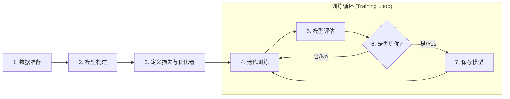
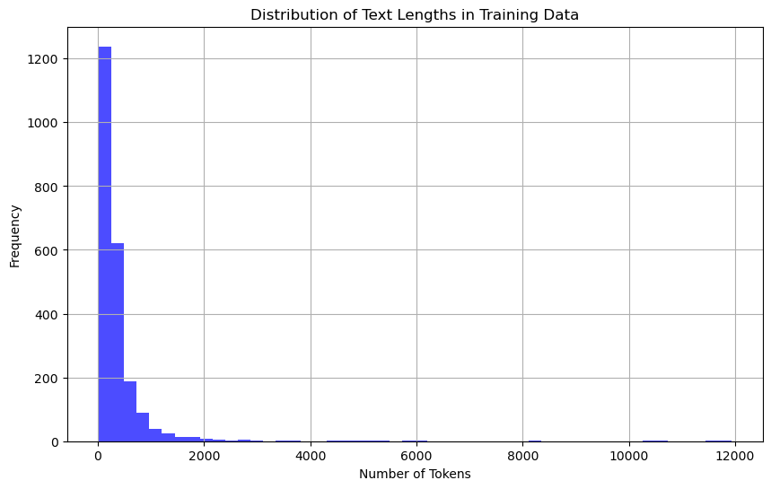
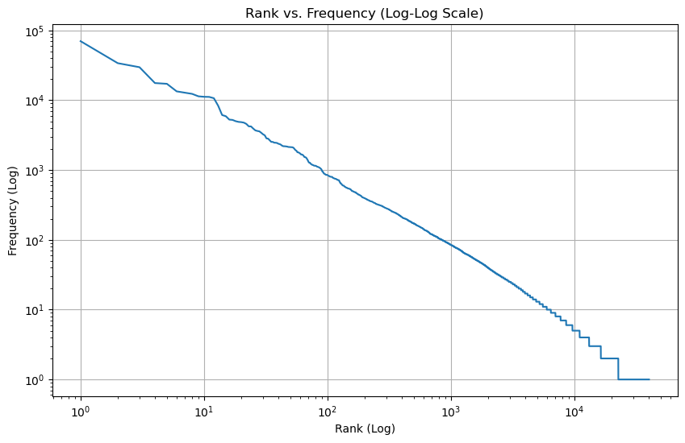

# 第一节 文本分类简单实现

## 一、文本分类任务概述

文本分类是 NLP 中常见的任务之一。它的目标是：给定一段文本，自动地将其分配到一个或多个预定义的类别中。典型的应用分类包括：

-   **情感分析**：判断一条评论（如商品评价、电影评论）是正面的、负面的还是中性的。
-   **新闻分类**：将一篇新闻报道自动归类到体育、财经、科技、娱乐等不同频道。
-   **意图识别**：在智能客服或语音助手中，识别用户输入的指令属于哪个意图（如“查询天气”、“播放音乐”）。
-   **垃圾邮件过滤**：自动识别并过滤掉收件箱中的垃圾邮件。

在**第二章**中，已经学习了如何将文本进行分词，并通过词向量技术将其转换为模型可以理解的数值形式。本节将在此基础上，以一个经典的新闻分类任务为例，详细讲解如何从零开始，一步步构建、训练和评估一个用于文本分类的深度学习模型。这个过程将涵盖数据处理、模型设计、训练循环、推理预测等所有核心环节。

## 二、NLP 项目通用流程

无论是文本分类，还是其他更复杂的NLP任务，其深度学习解决方案通常遵循一个标准化的项目流程。

可以概括为以下几个核心模块：



这个流程是搭建深度学习应用的通用范式，是一套标准化、可复用的模板。理解并掌握这套流程，比单纯实现某个模型更为重要。在接下来的内容中，我们将按照这个流程，将各个模块封装成独立的类，构建一个更规范、更易于维护和扩展的项目。

## 三、新闻文本分类代码实践

> [本节完整代码](https://github.com/datawhalechina/base-nlp/blob/main/code/C7/01_text_classification.ipynb)（[py版](https://github.com/datawhalechina/base-nlp/blob/main/code/C7/01_text_classification.py)）

本节将使用 `scikit-learn` 库中的 `20 Newsgroups` 数据集，这是一个包含约20000篇新闻文档、近似均衡分布在20个不同新闻组（类别）的集合。

### 3.1 模块化设计思路

在开始编写具体代码之前，更重要的步骤是“设计”。一个原则是，要先想清楚每个模块的输入和输出是什么。

- **数据模块的输出是什么？** -> 模型需要的“词元ID序列” (`token_ids`) 张量和“标签ID” (`label_ids`) 张量。
- **模型的输入是什么？** -> 数据模块的输出。
- **模型的输出是什么？** -> 每个类别的置信度。

> **如果对数据处理感到困惑，不妨先从模型定义开始**。一旦你清晰地定义了模型 `forward` 函数需要的输入（例如，ID序列），数据处理阶段的目标就变得很明确了——只需要把原始文本处理成模型所需的格式。

### 3.2 步骤一：数据解析与加载

#### 3.2.1 数据加载

首先，加载`scikit-learn`提供的原始数据集。

```python
from sklearn.datasets import fetch_20newsgroups

# 为了方便演示，只选择4个类别
categories = ['alt.atheism', 'soc.religion.christian', 'comp.graphics', 'sci.med']
train_dataset_raw = fetch_20newsgroups(subset='train', categories=categories, shuffle=True, random_state=42)
test_dataset_raw = fetch_20newsgroups(subset='test', categories=categories, shuffle=True, random_state=42)
```

#### 3.2.2 数据探索与可视化

在进行任何复杂的预处理之前，对数据进行探索性分析是很重要且必要的。这有助于我们理解数据特性，从而做出更合理的设计决策。

**1. 文本长度分布：**

```python
import matplotlib.pyplot as plt
import re

# 为了进行探索，先定义一个简单的分词函数
def _tokenize_text(text):
    text = text.lower()
    text = re.sub(r"[^a-z0-9(),.!?\\'`]", " ", text)
    text = re.sub(r"([,.!?\\'`])", r" \\1 ", text)
    tokens = text.strip().split()
    return tokens

# 计算每篇文档的词元数量
train_text_lengths = [len(_tokenize_text(text)) for text in train_dataset_raw.data]

plt.figure(figsize=(10, 6))
plt.hist(train_text_lengths, bins=50, alpha=0.7, color='blue')
plt.title('Distribution of Text Lengths in Training Data')
plt.xlabel('Number of Tokens')
plt.ylabel('Frequency')
plt.grid(True)
plt.show()
```

<div align="center">
  
  <p>图 1.1: 训练集文本长度分布</p>
</div>

**2. 词频分布：**

```python
from collections import Counter
import numpy as np

# 计算所有词元的频率
word_counts = Counter()
for text in train_dataset_raw.data:
    word_counts.update(_tokenize_text(text))

# 获取频率并按降序排序
frequencies = sorted(word_counts.values(), reverse=True)
# 生成排名
ranks = np.arange(1, len(frequencies) + 1)

# 绘制对数坐标图
plt.figure(figsize=(10, 6))
plt.loglog(ranks, frequencies)
plt.title('Rank vs. Frequency (Log-Log Scale)')
plt.xlabel('Rank (Log)')
plt.ylabel('Frequency (Log)')
plt.grid(True)
plt.show()
```

<div align="center">
  
  <p>图 1.2: 词频-排名对数图</p>
</div>

**分析与结论**:
- **文本长度长尾分布**：从 **图 1.1** 的文本长度分布直方图可以看出，大部分文本的长度集中在较短的区间，但存在少量长度非常长的“异常值”。这说明直接截断可能会丢失过多信息。
- **词频齐夫定律**：如 **图 1.2** 的对数坐标图所示，词频分布呈现出典型的“长尾”现象：少数高频词（图左上角）占据了绝大多数的出现次数，而大量词汇（图中长长的“尾巴”）的出现频率极低。

#### 3.2.3 Tokenizer 封装

创建一个`Tokenizer`（分词器）类，它将负责所有与分词、词典构建和ID转换相关的任务。它封装了与数据探索时相同的分词逻辑，并增加了ID转换等功能。其主要逻辑是：

- **分词策略**：`_tokenize_text` 方法实现了一套基于正则表达式的分词策略：先将文本转为小写；然后，通过 `re.sub` 移除非字母、数字和基本标点之外的字符；接着，为了确保标点符号能被作为独立的词元，在它们周围添加空格；最后，按空格切分文本，得到词元列表。
- **词典构建**：遍历所有训练文本，统计词频，并过滤掉出现次数过少的低频词，以减少词典规模和噪声。同时，词典初始化时会预设两个特殊的Token：`<PAD>`（用于填充，ID为0）和`<UNK>`（用于表示未登录词，ID为1）。

```python
import re
from collections import Counter
from tqdm import tqdm

class Tokenizer:
    def __init__(self, vocab):
        self.vocab = vocab
        self.token_to_id = {token: idx for token, idx in self.vocab.items()}

    @staticmethod
    def _tokenize_text(text):
        text = text.lower()
        text = re.sub(r"[^a-z0-9(),.!?\\'`]", " ", text)
        text = re.sub(r"([,.!?\\'`])", r" \\1 ", text)
        tokens = text.strip().split()
        return tokens

    def convert_tokens_to_ids(self, tokens):
        return [self.token_to_id.get(token, self.vocab["<UNK>"]) for token in tokens]

    def tokenize(self, text):
        return self._tokenize_text(text)
    
    def __len__(self):
        return len(self.vocab)

```

#### 3.2.4 Tokenizer与词典构建

基于前面对数据的分析，现在可以正式构建词典和`Tokenizer`。词典将只包含在训练集中出现超过`min_freq`次的词元。

```python
def build_vocab_from_counts(word_counts, min_freq=5):
    vocab = {"<PAD>": 0, "<UNK>": 1}
    for word, count in word_counts.items():
        if count >= min_freq:
            vocab[word] = len(vocab)
    return vocab

# 使用上一步计算出的word_counts来构建词典
vocab = build_vocab_from_counts(word_counts, min_freq=5)
tokenizer = Tokenizer(vocab)

print(f"过滤后的词典大小 (min_freq=5): {len(tokenizer)}")
```

#### 3.2.5 如何处理长文本？

在数据探索中能够发现，`20 Newsgroups`数据集中存在大量超长文本，有的甚至超过1万个词元。而大部分深度学习模型（尤其是非Transformer模型）都难以处理过长的序列，直接输入会导致内存溢出和计算效率低下。而简单的截断会丢失大量文本末尾的信息，可能会导致关键信息丢失。

一个更好的方法是将一篇长文档切分成多个固定长度、且有部分重叠的“文本块”（Chunks）。例如，一篇1000词的文档，可以按`max_len=128`，`overlap=26`的方式切分。

- 第一个块：`words[0:128]`
- 第二个块：`words[102:230]` (128-26=102)
- ...以此类推

这样做有两大好处：
1. **信息保全**：完整地利用了整篇文章的信息。
2. **数据增强**：将一篇长文档变成了多条训练样本，增加了训练数据量，有助于模型学习。

#### 3.2.6 封装 `Dataset` 和 `DataLoader`

`TextClassificationDataset` 负责的核心逻辑是：接收原始文本，调用`tokenizer`进行ID化，并应用 **滑窗分割** 策略处理长文本。如果文本超过`max_len`，则会进行切分。代码中的 `stride` 被设置为 `max_len` 的 80%，意味着每个文本块之间有20%的重叠，这有助于保持上下文信息的连续性。

`collate_fn`函数则负责将一个批次内长短不一的样本，通过 **填充** 操作（使用 `<PAD>` 对应的ID `0`），打包成形状规整的张量，以便模型进行批处理。

```python
import torch
from torch.utils.data import Dataset, DataLoader

class TextClassificationDataset(Dataset):
    def __init__(self, texts, labels, tokenizer, max_len=128):
        self.tokenizer = tokenizer
        self.max_len = max_len
        self.processed_data = []

        print("正在处理数据集...")
        for text, label in tqdm(zip(texts, labels), total=len(labels)):
            token_ids = self.tokenizer.convert_tokens_to_ids(self.tokenizer.tokenize(text))
            
            # 滑窗分割逻辑
            if len(token_ids) <= self.max_len:
                self.processed_data.append({"token_ids": token_ids, "label": label})
            else:
                stride = max(1, int(self.max_len * 0.8))
                for i in range(0, len(token_ids) - self.max_len + 1, stride):
                    chunk = token_ids[i:i+self.max_len]
                    self.processed_data.append({"token_ids": chunk, "label": label})
    
    def __len__(self):
        return len(self.processed_data)

    def __getitem__(self, idx):
        return self.processed_data[idx]

def collate_fn(batch):
    max_batch_len = max(len(item["token_ids"]) for item in batch)
    
    batch_token_ids, batch_labels = [], []

    for item in batch:
        token_ids = item["token_ids"]
        padding_len = max_batch_len - len(token_ids)
        
        padded_ids = token_ids + [0] * padding_len
        batch_token_ids.append(padded_ids)
        batch_labels.append(item["label"])
        
    return {
        "token_ids": torch.tensor(batch_token_ids, dtype=torch.long),
        "labels": torch.tensor(batch_labels, dtype=torch.long),
    }

# 创建Dataset和DataLoader实例
train_dataset = TextClassificationDataset(train_dataset_raw.data, train_dataset_raw.target, tokenizer)
train_loader = DataLoader(train_dataset, batch_size=32, shuffle=True, collate_fn=collate_fn)

valid_dataset = TextClassificationDataset(test_dataset_raw.data, test_dataset_raw.target, tokenizer)
valid_loader = DataLoader(valid_dataset, batch_size=32, collate_fn=collate_fn)

```

### 3.3 步骤二：模型构建

#### 3.3.1 模型结构设计

在编写模型代码前，先梳理清楚数据的“变形记”，即张量形状在网络中如何变化：

```
Input:
 token_ids (词元ID序列): [batch_size, seq_len]
     |
     V
nn.Embedding(padding_idx=0)
     |
     V
 embedded: [batch_size, seq_len, embed_dim]
     |
     V
nn.Linear(embed_dim, hidden_dim*2) -> nn.ReLU
     |
     V
 hidden_features: [batch_size, seq_len, hidden_dim*2]
     |
     V
nn.Linear(hidden_dim*2, hidden_dim*4) -> nn.ReLU
     |
     V
 token_features: [batch_size, seq_len, hidden_dim*4]
     |
     V
Masked Average Pooling (关键操作)
     |
     V
 pooled_features: [batch_size, hidden_dim*4]  <-- seq_len维度被聚合掉了
     |
     V
nn.Linear (分类层)
     |
     V
Output:
 logits: [batch_size, num_classes]
```

#### 3.3.2 掩码平均池化

池化（Pooling）的目的是将一个序列的特征（`[seq_len, hidden_dim]`）聚合成一个代表整条序列的向量（`[hidden_dim]`）。简单的平均池化会受到填充`<PAD>`的影响，导致语义偏差。

**举例说明：**
假设一个批次有2个句子，最大长度为4。
- 句子A (真实长度=4): `[v_I, v_love, v_NLP, v_too]`
- 句子B (真实长度=2): `[v_NLP, v_rocks, v_PAD, v_PAD]`

掩码池化的计算过程如下：
1. **创建掩码**: `mask = [[1, 1, 1, 1], [1, 1, 0, 0]]`
2. **向量置零**: 将句子B中 `<PAD>` 对应的向量 `v_PAD` 乘以0，使其变为零向量。
3. **向量求和**:
   - 句子A: `sum_A = v_I + v_love + v_NLP + v_too`
   - 句子B: `sum_B = v_NLP + v_rocks + 0 + 0`
4. **除以真实长度**:
   - 句子A: `pool_A = sum_A / 4`
   - 句子B: `pool_B = sum_B / 2`

通过这种方式，我们得到了不受填充影响的、精确的句子平均向量。

在`forward`方法中，这个过程被分解为四步：
1.  **创建掩码**: 根据输入的词元ID序列 (`token_ids`) 中不等于 `padding_idx` 的位置，生成一个值为0或1的掩码张量。
2.  **向量置零**: 利用广播机制，将特征向量与掩码相乘，所有填充位置的特征向量都会变为零向量。
3.  **向量求和**: 沿序列长度维度求和。
4.  **除以真实长度**: 求和结果再除以每个样本的真实长度（即掩码中1的数量），得到最终的池化向量。

#### 3.3.3 模型代码

```python
import torch.nn as nn
import torch.nn.functional as F

class TextClassifier(nn.Module):
    def __init__(self, vocab_size, embed_dim, hidden_dim, num_classes):
        super(TextClassifier, self).__init__()
        self.embedding = nn.Embedding(vocab_size, embed_dim, padding_idx=0)
        
        self.feature_extractor = nn.Sequential(
            nn.Linear(embed_dim, hidden_dim * 2),
            nn.ReLU(),
            nn.Linear(hidden_dim * 2, hidden_dim * 4),
            nn.ReLU(),
        )
        
        self.classifier = nn.Linear(hidden_dim * 4, num_classes)
        
    def forward(self, token_ids):
        # token_ids: [batch_size, seq_len]
        embedded = self.embedding(token_ids) # -> [batch_size, seq_len, embed_dim]
        hidden_features = self.feature_extractor(embedded) # -> [batch_size, seq_len, hidden_dim * 2]
        token_features = self.feature_extractor(embedded) # -> [batch_size, seq_len, hidden_dim * 4]
        
        padding_mask = (token_ids != self.embedding.padding_idx).float() # -> [batch_size, seq_len]
        masked_features = token_features * padding_mask.unsqueeze(-1) # -> [batch_size, seq_len, hidden_dim * 4]
        summed_features = torch.sum(masked_features, 1) # -> [batch_size, hidden_dim * 4]
        real_lengths = padding_mask.sum(1, keepdim=True) # -> [batch_size, 1]
        pooled_features = summed_features / torch.clamp(real_lengths, min=1e-9) # -> [batch_size, hidden_dim * 4]
        
        logits = self.classifier(pooled_features) # -> [batch_size, num_classes]
        
        return logits
```

### 3.4 步骤三：训练与评估

将所有与训练、评估、优化和模型保存相关的逻辑都封装到一个`Trainer`类中。这个类负责协调模型、数据和优化器，完成整个训练流程。

```python
import torch.nn.functional as F

class Trainer:
    def __init__(self, model, optimizer, criterion, train_loader, valid_loader, device):
        self.model = model
        self.optimizer = optimizer
        self.criterion = criterion
        self.train_loader = train_loader
        self.valid_loader = valid_loader
        self.device = device
        self.best_accuracy = 0.0

    def _run_epoch(self, epoch):
        self.model.train()
        total_loss = 0
        # 使用tqdm来显示进度条
        for batch in tqdm(self.train_loader, desc=f"Epoch {epoch+1} [训练中]"):
            self.optimizer.zero_grad()
            
            token_ids = batch["token_ids"].to(self.device)
            labels = batch["labels"].to(self.device)
            
            outputs = self.model(token_ids)
            loss = self.criterion(outputs, labels)
            total_loss += loss.item()
            
            loss.backward()
            self.optimizer.step()
        
        return total_loss / len(self.train_loader)

    def _evaluate(self, epoch):
        self.model.eval()
        correct_preds = 0
        total_samples = 0
        with torch.no_grad():
            for batch in tqdm(self.valid_loader, desc=f"Epoch {epoch+1} [评估中]"):
                token_ids = batch["token_ids"].to(self.device)
                labels = batch["labels"].to(self.device)
                
                outputs = self.model(token_ids)
                _, predicted = torch.max(outputs, 1)
                
                total_samples += labels.size(0)
                correct_preds += (predicted == labels).sum().item()
        
        return correct_preds / total_samples

    def _save_checkpoint(self, epoch, val_accuracy):
        if val_accuracy > self.best_accuracy:
            self.best_accuracy = val_accuracy
            torch.save(self.model.state_dict(), "best_model.pth")
            print(f"新最佳模型已保存! Epoch: {epoch+1}, 验证集准确率: {val_accuracy:.4f}")

    def train(self, epochs, tokenizer, label_map):
        for epoch in range(epochs):
            avg_loss = self._run_epoch(epoch)
            val_accuracy = self._evaluate(epoch)
            
            print(f"Epoch {epoch+1}/{epochs} | 训练损失: {avg_loss:.4f} | 验证集准确率: {val_accuracy:.4f}")
            
            self._save_checkpoint(epoch, val_accuracy)
        
        print("训练完成！")
        # 训练结束后，保存最终的词典和标签映射
        import json
        with open('vocab.json', 'w', encoding='utf-8') as f:
           json.dump(tokenizer.vocab, f, ensure_ascii=False, indent=4)
        with open('label_map.json', 'w', encoding='utf-8') as f:
           json.dump(label_map, f, ensure_ascii=False, indent=4)
        print("词典 (vocab.json) 和标签映射 (label_map.json) 已保存。")

```

### 3.5 步骤四：执行训练

通过前面的精心封装，现在执行训练的入口代码变得非常直观和简洁。只需实例化所有需要的“零件”，然后将它们交给“训练总管”`Trainer`即可。

```python
# 超参数
VOCAB_SIZE = len(tokenizer)
EMBED_DIM = 128
HIDDEN_DIM = 256
NUM_CLASSES = len(train_dataset_raw.target_names)
EPOCHS = 10
LEARNING_RATE = 0.001
DEVICE = "cuda" if torch.cuda.is_available() else "cpu"

# 实例化
model = TextClassifier(VOCAB_SIZE, EMBED_DIM, HIDDEN_DIM, NUM_CLASSES).to(DEVICE)
criterion = nn.CrossEntropyLoss()
optimizer = torch.optim.Adam(model.parameters(), lr=LEARNING_RATE)

# 实例化训练器
trainer = Trainer(model, optimizer, criterion, train_loader, valid_loader, DEVICE)

# 创建 标签名 -> ID 的映射，并传入 trainer 以便保存
label_map = {name: i for i, name in enumerate(train_dataset_raw.target_names)}

# 开始训练
trainer.train(epochs=EPOCHS, tokenizer=tokenizer, label_map=label_map)

```

### 3.6 步骤五：模型推理

训练完成后，最终的目的是使用模型对全新的、未见过的数据进行预测。一个健壮的推理流程必须确保使用与训练时完全相同的预处理配置（特别是词典）和模型权重。

#### 3.6.1 长文本推理的聚合策略

由于我们对长文本进行了滑窗分割，一篇原始文档在推理时会得到多个文本块的预测结果。如何将这些结果聚合成一个最终预测？

- **策略一：多数投票法**
  这是最直观的方法。分别看每个文本块被预测成了哪个类别，然后选择得票最多的那个类别作为最终结果。如果出现平票，可以选择置信度总和最高的那个类别。
- **策略二：概率累乘/平均法**
  计算每个类别在所有文本块上的平均置信度（或概率），然后选择平均置信度最高的类别。累乘也是一种选择，但在实践中容易因小概率值导致数值下溢，取对数后再求和（等价于累乘）或直接平均更常用。

下面的`Predictor`类将封装完整的推理流程，并实现了“多数投票法”作为聚合策略。

```python
import json

class Predictor:
    def __init__(self, model, tokenizer, label_map, device, max_len=128):
        self.model = model.to(device)
        self.model.eval()
        self.tokenizer = tokenizer
        self.label_map = label_map
        self.id_to_label = {idx: label for label, idx in self.label_map.items()}
        self.device = device
        self.max_len = max_len

    def predict(self, text):
        token_ids = self.tokenizer.convert_tokens_to_ids(self.tokenizer.tokenize(text))
        chunks = []
        if len(token_ids) <= self.max_len:
            chunks.append(token_ids)
        else:
            stride = max(1, int(self.max_len * 0.8))
            for i in range(0, len(token_ids) - self.max_len + 1, stride):
                chunks.append(token_ids[i:i + self.max_len])
        
        chunk_tensors = torch.tensor(chunks, dtype=torch.long).to(self.device)
        with torch.no_grad():
            outputs = self.model(chunk_tensors)
            preds = torch.argmax(outputs, dim=1)

        final_pred_id = torch.bincount(preds).argmax().item()
        
        final_pred_label = self.id_to_label[final_pred_id]
        return final_pred_label

# --- 完整的推理流程 ---
# 1. 加载资源
with open('vocab.json', 'r', encoding='utf-8') as f:
    loaded_vocab = json.load(f)
with open('label_map.json', 'r', encoding='utf-8') as f:
    label_map_loaded = json.load(f)

# 2. 实例化推理所需组件
inference_tokenizer = Tokenizer(vocab=loaded_vocab)
inference_model = TextClassifier(len(inference_tokenizer), EMBED_DIM, HIDDEN_DIM, NUM_CLASSES)
inference_model.load_state_dict(torch.load("best_model.pth"))

# 3. 创建Predictor实例
predictor = Predictor(inference_model, inference_tokenizer, label_map_loaded, DEVICE)

# 4. 预测新文本
new_text = "The doctor prescribed a new medicine for the patient's illness, focusing on its gpu accelerated healing properties."
predicted_class = predictor.predict(new_text)
print(f"\n文本: '{new_text}'")
print(f"预测类别: {predicted_class}")

```

## 四、过拟合问题

刚刚构建的模型并没有考虑 **过拟合（Overfitting）** 的问题，即模型在训练集上表现优异，但在未见过的验证集或测试集上表现不佳。下面简单介绍两个方案：

1. **提前停止（早停）**
   - **思想**：在`Trainer`的`train`方法中，持续监控验证集的准确率（或损失）。如果发现验证集准确率连续N个轮次（N被称为“耐心值”，Patience）都没有超过历史最佳值，就提前终止训练。
   - **实现**：可以在`Trainer`中增加一个`patience`参数和一个计数器来实现此逻辑。

2. **随机Token遮盖**
   - **思想**：这是一种数据增强方法。在**训练过程**中，随机地将文本中的一部分词元（例如15%）替换为`<UNK>`。这迫使模型不能过度依赖个别“明星词汇”，而是要学习更全面的上下文语义来进行判断，从而提升模型的泛化能力。
   - **实现**：这个修改可以在`TextClassificationDataset`类的`__getitem__`方法中，在返回数据前增加一个随机替换的步骤。注意，此操作只应在训练时进行。

---

> Jupyter Notebook 非常适合实验和教学，但在实践中，将代码组织成结构化的 Python 项目（`.py`文件）更利于维护、复用和协作。
