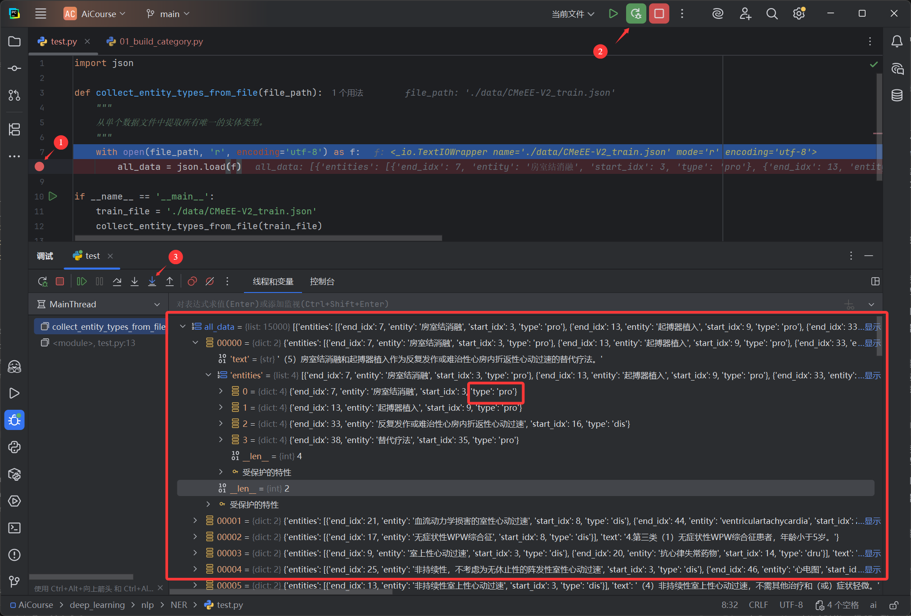

# 第二节 NER 项目的数据处理

在上一节，我们简单了解了命名实体识别的任务定义、应用场景及主流实现方法。本节将正式进入编码阶段，从数据处理开始，逐步构建一个完整的 NER 项目。为了清晰地构建 NER 的处理流程，我们采用流程化的代码组织思路，将整个流程拆分为多个独立的脚本。

> [本节完整代码](https://github.com/datawhalechina/base-nlp/tree/main/code/C8)

## 一、数据处理流程总览

在 NLP 中，原始的文本和标注数据是无法直接被神经网络模型利用的。需要将这些原始数据转换成模型能够理解的、标准化的数字张量。那么，具体要转换成什么样？又该如何转换？这就是本节数据处理流程要解决的问题。

### 1.1 明确数据处理的目标

在设计之前，我们首先要明确最终的目标。对于一个命名实体识别任务，数据处理需要产出什么？

1.  **模型的输入 (X) 是什么？**
    -   它应该是一个整数张量，形状为 `[batch_size, seq_len]`。
    -   其中 `batch_size` 是批次大小，`seq_len` 是序列长度（通常是批次内最长句子的长度）。
    -   张量中的每一个数字，都代表原始句子中一个字符（Token）在词汇表里对应的唯一 ID。

2.  **模型的标签 (Y) 是什么？**
    -   它也应该是一个整数张量，形状与输入 X 完全相同，即 `[batch_size, seq_len]`。
    -   其中的每一个数字，代表着对应位置字符的实体标签 ID（例如，`B-bod` 对应的 ID）。

3.  **如何实现从“文本”到“ID”的转换？**
    -   **文本 -> Token ID**：需要构建一个 “字符-ID” 的映射表，也就是**词汇表 (Vocabulary)**。
    -   **实体 -> 标签 ID**：需要构建一个 “标签-ID” 的映射表。

### 1.2 数据格式解析

我们使用的是 `CMeEE-V2`（中文医学实体抽取）数据集。经过分析，该数据集采用的是标准的 **JSON 数组** 格式。

#### 1.2.1 原始数据示例

打开 `CMeEE-V2_train.json`，可以看到文件内容是一个完整的 JSON 数组：

```json
[
  ...,
  {
    "text": "（2）室上性心动过速可用常规抗心律失常药物控制，年龄小于5岁。",
    "entities": [
      {
        "start_idx": 3,
        "end_idx": 9,
        "type": "dis",
        "entity": "室上性心动过速"
      },
      {
        "start_idx": 14,
        "end_idx": 20,
        "type": "dru",
        "entity": "抗心律失常药物"
      }
    ]
  },
  ...
]
```

#### 1.2.2 字段说明

-   **`text`**：原始文本字符串
-   **`entities`**：实体标注列表，每个实体包含：
    -   `start_idx`：实体起始位置（**包含**）
    -   `end_idx`：实体结束位置（**包含**）
    -   `type`：实体类型（如 `dis` 疾病、`dru` 药物）
    -   `entity`：实体文本（用于验证）

> **索引的包含性**
>
> 对于当前 `data/` 目录下的数据，经实测：`start_idx` 与 `end_idx` 均为**包含**（闭区间）。实体应由 `text[start_idx : end_idx + 1]` 取得。例如：
> - 文本："（2）室上性心动过速可用常规抗心律失常药物控制，年龄小于5岁。"
> - 实体 "室上性心动过速"：`start_idx=3, end_idx=9`
> - 实际字符：`text[3:10]` = "室上性心动过速"
>
> 所以，实体长度 = `end_idx - start_idx + 1`。

## 二、构建标签映射

> **目标**：从原始数据中提取所有实体类型，然后基于 `BMES` 标注方案构建一个全局统一的“标签-ID”映射表。

### 2.1 加载数据

在处理任何数据之前，首要需要把它加载到内存里。

#### 2.1.1 调试观察数据结构

开始的代码很简单，只有一个目的：读取文件并加载其内容。

```python
import json

def collect_entity_types_from_file(file_path):
    with open(file_path, 'r', encoding='utf-8') as f:
        all_data = json.load(f) # 下断点

if __name__ == '__main__':
    train_file = './data/CMeEE-V2_train.json'
    collect_entity_types_from_file(train_file)
```

**操作指引**：

如 **图 2.1** 所示，调试过程分为三步：
1.  **设置断点**：在代码行 `all_data = json.load(f)` 左侧的行号旁边单击，设置一个断点。
2.  **启动调试**：点击 PyCharm 右上角的“Debug”按钮（绿色甲虫图标），以调试模式运行当前脚本。程序会自动执行到断点所在行并 **暂停**，此时 `all_data` 变量还未被赋值。
3.  **单步执行 (Step Over)**：点击调试控制台中的“Step Over”按钮。此操作会执行当前行代码。执行后，`all_data` 变量才会被成功赋值。

<div align="center">
  
  <p>图 2.1: PyCharm 调试器观察数据结构</p>
</div>

完成以上步骤后，可以在下方的“Debug”工具窗口中展开 `all_data` 变量，从而审查其内部结构。通过观察 **图 2.1**，可以得出结论：
-   `all_data` 是一个 `list`（列表）。
-   列表中的每一个元素都是一个 `dict`（字典），代表一条标注数据。
-   每个字典都包含 `text` 和 `entities` 两个键。

> 以上步骤以 PyCharm 为例，但其调试逻辑（设置断点、启动调试、单步执行）在 VS Code 等其他主流 IDE 中是完全通用的。
>
> 刚刚我们通过断点调试，清楚地看到了 `all_data` 的内部结构，这为编写后续的遍历代码提供了依据。请记住这种方法，后续学习中如果遇到任何不理解的代码或不清楚的变量，都可以使用同样的方式：“**哪里不会 D 哪里**😉”。

#### 2.1.2 提取实体类型

既然已经清楚了数据结构，现在要做的就是遍历这个列表，从每个字典中提取出我们真正关心的信息——实体类型。

```python
import json

def collect_entity_types_from_file(file_path):
    types = set()
    with open(file_path, 'r', encoding='utf-8') as f:
        all_data = json.load(f)
        for data in all_data:
            # 遍历实体列表，提取 'type' 字段
            for entity in data['entities']:
                types.add(entity['type'])
    return types

if __name__ == '__main__':
    train_file = './data/CMeEE-V2_train.json'
    entity_types = collect_entity_types_from_file(train_file)
    print(f"从 {train_file} 中提取的实体类型: {entity_types}")
```

运行结果：
```
从 ./data/CMeEE-V2_train.json 中提取的实体类型: {'dru', 'dep', 'dis', 'bod', 'mic', 'equ', 'sym', 'pro', 'ite'}
```

### 2.2 处理多个文件并保证顺序

下一步需要完成两件事：
1.  处理所有的数据文件（训练集、验证集），以确保包含了全部的实体类型。
2.  对提取出的实体类型进行**排序**，以保证每次生成的标签 ID 映射都是完全一致的。

基于此，对代码进行扩展：

```python
# (collect_entity_types_from_file 函数保持不变，此处省略)
# ...

def generate_tag_map(data_files):
    all_entity_types = set()
    for file_path in data_files:
        types_in_file = collect_entity_types_from_file(file_path)
        all_entity_types.update(types_in_file)
    
    # 排序，保证每次运行结果一致
    sorted_types = sorted(list(all_entity_types))

    # 后续将在这里构建 BMES 映射
    # ...

if __name__ == '__main__':
    train_file = './data/CMeEE-V2_train.json'
    dev_file = './data/CMeEE-V2_dev.json'
    
    generate_tag_map(data_files=[train_file, dev_file])
```

### 2.3 构建 BMES 标签映射

有了排序后的实体类型列表，就可以构建最终的 `tag_to_id` 映射字典了。规则如下：
- 非实体标签 `'O'` 的 ID 为 `0`。
- 对于每一种实体类型（如 `dis`），都生成 `B-dis`, `M-dis`, `E-dis`, `S-dis` 四种标签，并按顺序赋予递增的 ID。

```python
# ... (在 generate_tag_map 函数内部) ...

# ... (汇总和排序逻辑) ...
sorted_types = sorted(list(all_entity_types))

# 构建 BMES 标签映射
tag_to_id = {'O': 0}  # 'O' 代表非实体
for entity_type in sorted_types:
    for prefix in ['B', 'M', 'E', 'S']:
        tag_name = f"{prefix}-{entity_type}"
        tag_to_id[tag_name] = len(tag_to_id)

print(f"\n已生成 {len(tag_to_id)} 个标签映射。")
```

### 2.4 封装与保存

为了让这个映射表能够被其他脚本方便地使用，需要将它保存成一个 JSON 文件。

```python
def save_json(data, file_path):
    os.makedirs(os.path.dirname(file_path), exist_ok=True)
    with open(file_path, 'w', encoding='utf-8') as f:
        json.dump(data, f, ensure_ascii=False, indent=4)

def collect_entity_types_from_file(file_path):
    # ... (函数已在前面定义，此处省略)

def generate_tag_map(data_files, output_file): # 添加 output_file 参数
    # 1. 汇总所有实体类型 ...

    # 2. 排序以保证映射一致性 ...

    # 3. 构建 BMES 标签映射 ...

    # 4. 保存映射文件
    save_json(tag_to_id, output_file)
    print(f"标签映射已保存至: {output_file}")

if __name__ == '__main__':
    train_file = './data/CMeEE-V2_train.json'
    dev_file = './data/CMeEE-V2_dev.json'
    output_path = './data/categories.json'
    generate_tag_map(data_files=[train_file, dev_file], output_file=output_path)
```

通过这样一步步的迭代和完善，我们从一个基础的思路，最终构建出了一个可复用的预处理脚本。

### 2.5 运行结果

执行最终的 `01_build_category.py` 脚本，会生成 `categories.json` 文件，内容如下（部分展示）：

```json
{
    "O": 0,
    "B-bod": 1,
    "M-bod": 2,
    "E-bod": 3,
    "S-bod": 4,
    "B-dep": 5,
    "M-dep": 6,
    "E-dep": 7,
    "S-dep": 8,
    "B-dis": 9,
    "M-dis": 10,
    "E-dis": 11,
    "S-dis": 12,
    ...
}
```

## 三、构建词汇表

有了标签映射，我们还需要创建一个“字符-ID”的映射表（即词汇表），为后续将文本转换为数字序列做准备。

### 3.1 统计所有字符

目前的首要任务是获取数据中出现的所有字符。

```python
from collections import Counter
import json

def create_char_vocab(data_files):
    char_counts = Counter()
    with open(data_files, 'r', encoding='utf-8') as f:
        all_data = json.load(f)
        for data in all_data:
            char_counts.update(list(data['text']))
    
    print(f"初步统计的字符种类数: {len(char_counts)}")

if __name__ == '__main__':
    train_file = './data/CMeEE-V2_train.json'
    create_char_vocab(train_file)
```

### 3.2 文本规范化

在检查初步统计的字符时，会发现一个问题：数据中可能同时包含 **全角字符**（如 `，`，`（`）和 **半角字符**（如 `,`，`(`）。它们在语义上相同，但会被视为两个不同的 token（如图 2.2 所示）。

<div align="center">
  
  <p>图 2.2: 全角/半角字符混用</p>
</div>

为了减小词汇表规模并提升模型泛化能力，可以将它们统一。一个通用的策略是 **将所有全角字符转换为半角字符**。

```python
def normalize_text(text):
    """
    规范化文本，例如将全角字符转换为半角字符。
    """
    full_width = "０１２３４５６７８９ＡＢＣＤＥＦＧＨＩＪＫＬＭＮＯＰＱＲＳＴＵＶＷＸＹＺａｂｃｄｅｆｇｈｉｊｋｌｍｎｏｐｑｒｓｔｕｖｗｘｙｚ！＃＄％＆’（）＊＋，－．／：；＜＝＞？＠［＼］＾＿｀｛｜｝～＂"
    half_width = r"0123456789ABCDEFGHIJKLMNOPQRSTUVWXYZabcdefghijklmnopqrstuvwxyz!#$%&'" + r'()*+,-./:;<=>?@[\]^_`{|}~".'
    mapping = str.maketrans(full_width, half_width)
    return text.translate(mapping)

def create_char_vocab(data_files):
    char_counts = Counter()
    with open(data_files, 'r', encoding='utf-8') as f:
        all_data = json.load(f)
        for data in all_data:
            # 在统计前先进行规范化
            normalized_text = normalize_text(data['text'])
            char_counts.update(list(normalized_text))
    
    print(f"初步统计的字符种类数: {len(char_counts)}")
```

### 3.3 过滤、排序与添加特殊符

接下来，进行收尾工作：
1.  **过滤低频词**：可以设定一个阈值 `min_freq`，移除出现次数过少的罕见字，以进一步精简词汇表。
2.  **排序**：与标签映射一样，对最终的字符列表进行排序，确保每次生成的词汇表文件内容完全一致。
3.  **添加特殊 Token**：在列表的最前面，加入两个特殊的标记：`<PAD>`（用于后续对齐序列）和 `<UNK>`（用于表示词汇表中不存在的未知字符）。

### 3.4 封装与保存

将以上所有逻辑整合，并加入保存文件的功能，便得到了最终的脚本。

```python
 # ... 

def save_json(data, file_path):
    # ... (函数与上个脚本中相同，此处省略)

def normalize_text(text):
    # ... (函数已在前面定义，此处省略)

def create_char_vocab(data_files, output_file, min_freq=1):
    # 1. 统计规范化后的字符频率
    char_counts = Counter()
    for file_path in data_files:
        with open(file_path, 'r', encoding='utf-8') as f:
            all_data = json.load(f)
            for data in all_data:
                text = normalize_text(data['text'])
                char_counts.update(list(text))

    # 2. 过滤低频词
    frequent_chars = [char for char, count in char_counts.items() if count >= min_freq]
    
    # 3. 排序
    frequent_chars.sort()

    # 4. 添加特殊标记
    special_tokens = ["<PAD>", "<UNK>"]
    final_vocab_list = special_tokens + frequent_chars
    
    print(f"词汇表大小 (min_freq={min_freq}): {len(final_vocab_list)}")

    # 5. 保存词汇表
    save_json(final_vocab_list, output_file)
    print(f"词汇表已保存至: {output_file}")


if __name__ == '__main__':
    train_file = './data/CMeEE-V2_train.json'
    dev_file = './data/CMeEE-V2_dev.json'
    output_path = './data/vocabulary.json'
    create_char_vocab(data_files=[train_file, dev_file], output_file=output_path, min_freq=1)
```

## 四、封装数据加载器

现在有了标签映射和词汇表，最后一步就是构建一个可复用的 `DataLoader`，将文本数据高效地转换成 PyTorch 模型能够理解的格式。直接用循环读取数据并手动转换是低效且不灵活的。一个合格的数据加载器需要解决**自动批量化**、**序列填充**、**数据转换**和**随机化**这几个问题。

所以我们将整个流程拆分为以下几个步骤来逐步实现：
-   **步骤一：封装 `Vocabulary` 类**，专门负责 Token 和 ID 之间的转换。
-   **步骤二：创建 `NerDataset`**，继承自 PyTorch 的 `Dataset`，负责处理单个数据样本的转换。
-   **步骤三：定义 `collate_fn` 函数**，负责将多个样本打包、填充成一个 batch。
-   **步骤四：整合所有组件**，创建一个 `DataLoader` 实例并进行测试。

### 4.1 封装 Vocabulary 类

第一步，创建一个 `Vocabulary` 类来加载之前生成的 `vocabulary.json`，并提供方便的查询接口。这个类主要负责 Token 和 ID 之间的转换。

```python
import json

class Vocabulary:
    """
    负责管理词汇表和 token 到 id 的映射。
    """
    def __init__(self, vocab_path):
        with open(vocab_path, 'r', encoding='utf-8') as f:
            self.tokens = json.load(f)
        self.token_to_id = {token: i for i, token in enumerate(self.tokens)}
        self.pad_id = self.token_to_id['<PAD>']
        self.unk_id = self.token_to_id['<UNK>']

    def __len__(self):
        return len(self.tokens)

    def convert_tokens_to_ids(self, tokens):
        return [self.token_to_id.get(token, self.unk_id) for token in tokens]

if __name__ == '__main__':
    vocab_file = './data/vocabulary.json'
    vocabulary = Vocabulary(vocab_path=vocab_file)
    print(f"词汇表大小: {len(vocabulary)}")
```

### 4.2 创建 NerDataset

现在要创建的是核心的数据集类，它继承了 `torch.utils.data.Dataset`。负责将单条原始数据转换为模型所需的 `token_ids` 和 `label_ids`。可以把它想象成一个数据处理的“单件工厂”，`DataLoader` 每次需要数据时，都会向这个工厂索要一件（`__getitem__`）加工好的产品。

```python
# ... 
from torch.utils.data import Dataset
# ... (需要 normalize_text 函数) ...

class Vocabulary:
    # ... (类已在前面定义，此处省略)

class NerDataset(Dataset):
    def __init__(self, data_path, vocab: Vocabulary, tag_map: dict):
        # 一次性将整个 JSON 文件（一个大列表）读入内存
        self.vocab = vocab
        self.tag_to_id = tag_map
        with open(data_path, 'r', encoding='utf-8') as f:
            self.records = json.load(f)

    def __len__(self):
        return len(self.records)

    def __getitem__(self, idx):
        # 1. 根据索引获取原始记录
        record = self.records[idx]
        text = normalize_text(record['text'])
        tokens = list(text)
        
        # 2. 将文本字符转换为 token_ids
        token_ids = self.vocab.convert_tokens_to_ids(tokens)

        # 3. 生成与文本等长的 tag 序列，默认为 'O'
        tags = ['O'] * len(tokens)
        
        # 4. 遍历实体列表，用 BMES 标签覆盖默认的 'O'
        for entity in record.get('entities', []):
            entity_type = entity['type']
            start = entity['start_idx']
            end = entity['end_idx']  # 闭区间结束索引

            if end >= len(tokens): continue

            if start == end:
                tags[start] = f'S-{entity_type}' # 单字实体
            else:
                tags[start] = f'B-{entity_type}' # 实体开始
                tags[end] = f'E-{entity_type}'   # 实体结束
                for i in range(start + 1, end):
                    tags[i] = f'M-{entity_type}' # 实体中间

        # 5. 将 BMES 标签字符串序列转换为 label_ids
        label_ids = [self.tag_to_id[tag] for tag in tags]

        # 6. 返回包含两个 Tensor 的字典
        return {
            "token_ids": torch.tensor(token_ids, dtype=torch.long),
            "label_ids": torch.tensor(label_ids, dtype=torch.long)
        }

if __name__ == '__main__':
    # 为测试 NerDataProcessor 准备所需的 vocab 和 tag_map
    vocab_file = './data/vocabulary.json'
    categories_file = './data/categories.json'
    train_file = './data/CMeEE-V2_train.json'
    
    vocabulary = Vocabulary(vocab_path=vocab_file)
    with open(categories_file, 'r', encoding='utf-8') as f:
        tag_map = json.load(f)
        
    # 创建数据集实例
    train_dataset = NerDataset(train_file, vocabulary, tag_map)
    print(f"数据集大小: {len(train_dataset)}")
```

### 4.3 整合为 DataLoader

最后，定义 `create_ner_dataloader` 函数。它接收 `Dataset` 实例，并将其封装成一个 `DataLoader`。在 NLP 任务中，由于每个样本（句子）的长度都不同，所以不能直接让 `DataLoader` 使用默认的方式打包数据，否则会因序列长度不一而报错。因此，我们需要提供一个自定义的 `collate_fn` (校对函数) 来解决这个问题。

`collate_fn` 的主要任务，就是将从 `Dataset` 中取出的、由多条数据组成的列表（`batch`），“聚合”成一个统一的、规整的批次。在当前任务中，它主要负责两件事：

1.  **动态填充 (Padding)**：找到当前批次中最长的序列，并将这个批次内的所有样本都填充到这个最大长度。
2.  **生成 Attention Mask**：创建一个 `mask` 矩阵，用来标记哪些是真实的 Token (值为 `1`)，哪些是填充的 Token (值为 `0`)。

```python
# ... 
from torch.utils.data import Dataset, DataLoader
from torch.nn.utils.rnn import pad_sequence
# ... (省略前面所有的类和函数定义) ...

def create_ner_dataloader(data_path, vocab, tag_map, batch_size, shuffle=False):
    dataset = NerDataset(data_path, vocab, tag_map)
    
    def collate_batch(batch):
        token_ids_list = [item['token_ids'] for item in batch]
        label_ids_list = [item['label_ids'] for item in batch]

        padded_token_ids = pad_sequence(token_ids_list, batch_first=True, padding_value=vocab.pad_id)
        padded_label_ids = pad_sequence(label_ids_list, batch_first=True, padding_value=-100)
        attention_mask = (padded_token_ids != vocab.pad_id).long()

        return {
            "token_ids": padded_token_ids,
            "label_ids": padded_label_ids,
            "attention_mask": attention_mask
        }

    return DataLoader(
        dataset,
        batch_size=batch_size,
        shuffle=shuffle,
        collate_fn=collate_batch
    )

if __name__ == '__main__':
    # 文件路径
    train_file = './data/CMeEE-V2_train.json'
    vocab_file = './data/vocabulary.json'
    categories_file = './data/categories.json'

    # 1. 加载资源
    vocabulary = Vocabulary(vocab_path=vocab_file)
    with open(categories_file, 'r', encoding='utf-8') as f:
        tag_map = json.load(f)

    # 2. 创建 DataLoader
    train_loader = create_ner_dataloader(
        data_path=train_file,
        vocab=vocabulary,
        tag_map=tag_map,
        batch_size=4,
        shuffle=True
    )

    # 3. 验证一个批次的数据
    batch = next(iter(train_loader))
    
    print("\n--- DataLoader 输出验证 ---")
    print(f"  Token IDs shape: {batch['token_ids'].shape}")
    print(f"  Label IDs shape: {batch['label_ids'].shape}")
    print(f"  Attention Mask shape: {batch['attention_mask'].shape}")
```

`torch.utils.data.DataLoader` 是 PyTorch 的核心数据加载工具，它像一个高度自动化的“数据供应管道”。将 `NerDataProcessor` 实例（`dataset`）作为数据源传入，并配置了几个关键参数：
-   **`batch_size`**：定义了每个批次包含多少样本。
-   **`shuffle=True`**：使得加载器在每个 epoch 开始时都随机打乱数据顺序，能有效提升泛化能力。
-   **`collate_fn`**：这是最关键的参数，它指定了如何将 `batch_size` 个单独的样本“校对”和“打包”成一个规整的批次。传入的 `collate_batch` 函数在这里完成了动态填充和 `attention_mask` 的创建工作。


> **为什么 `tag_ids` 的填充值是 `-100`？**
>
> 这是一个 PyTorch 中的惯例。在计算损失时，我们不希望填充位置的标签对最终的损失值和梯度产生影响。PyTorch 的交叉熵损失函数 `torch.nn.CrossEntropyLoss` 中有一个参数 `ignore_index`，它的默认值恰好是 `-100`。
>
> 当损失函数看到标签值为 `-100` 时，会自动“忽略”这个位置，不计算它的损失。
