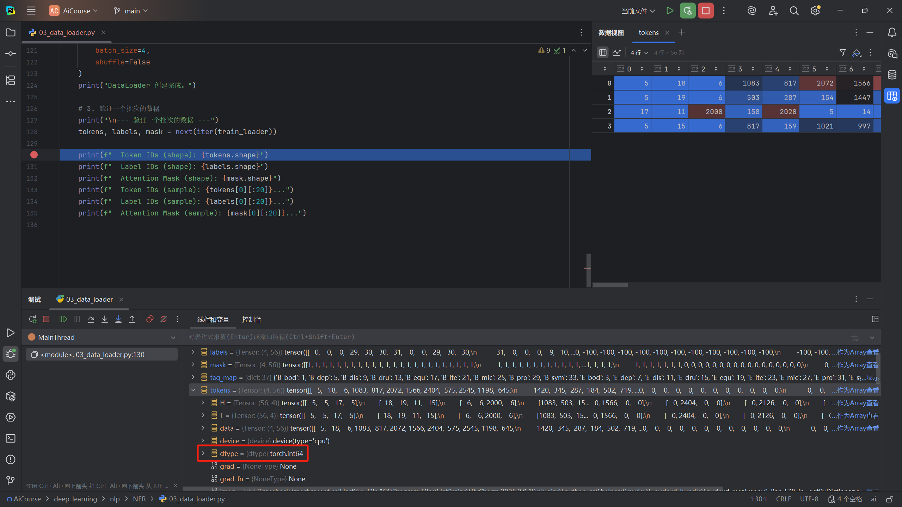

# 第三节 模型构建、训练与推理

书接上回，我们已经完成了 NER 项目的数据处理工作，包括构建标签映射、词汇表以及一个功能完备的 `DataLoader`。本节将聚焦于如何利用 PyTorch 构建一个序列标注模型，并进一步封装一个可复用的训练流程，最终实现模型的训练、评估与推理。

> [本节完整代码](https://github.com/datawhalechina/base-nlp/tree/main/code/C8)

## 一、模型结构设计

正如第一节所介绍，NER 任务本质上是一个 **序列标注** 问题——为输入序列中的每一个 Token 预测一个对应的标签。基于此，可以设计一个有效的模型结构，它主要由三个核心部分组成：

1.  **Token Embedding 层**
    -   **作用**：将输入的 `token_ids`（一串数字）转换为初始的词向量。
    -   **实现**：通常使用 `torch.nn.Embedding` 层。它就像一个可学习的、巨大的查询表，每个 `token_id` 对应表中的一行（一个向量）。这些向量在训练开始时随机初始化，并随着模型训练过程不断优化。这个阶段产出的其实就是 **静态词向量**，因为它不考虑上下文，同一个字在任何句子中都对应同一个向量。

2.  **动态特征提取层**
    -   **作用**：让模型理解上下文，生成包含上下文特征信息的 **动态词向量**。由于静态词向量无法区分同一个词在不同上下文中的含义，所以需要一个 Encoder 来融合上下文信息，从而生成更能体现语义的动态词向量。
    -   **实现**：循环神经网络 (RNN) 及其变体（如 LSTM, GRU）是处理序列数据的经典选择。我们可以使用 **双向 GRU (Bi-GRU)**，它能够同时从左到右和从右到左两个方向捕捉序列信息，从而更全面地理解每个 Token 的上下文。当然，也可以使用其他更强大的模型，如 **BERT**，来作为特征提取器。

3.  **分类决策层**
    -   **作用**：基于包含上下文信息的动态词向量，为每个 Token 预测其最终的实体标签（如 `B-dis`, `O` 等）。
    -   **实现**：通常使用一个简单的全连接层 (`torch.nn.Linear`)。它将 Encoder 输出的动态词向量从 `hidden_size` 维度映射到 `num_classes`（标签总数）维度，得到的输出即为每个 Token 在所有标签上的置信度得分。

> 整个模型本质上是一个 **Token 分类模型**：接收 Token 序列，并为其中的每一个 Token 输出一个分类结果。

## 二、构建 PyTorch 模型

编写模型代码之前，先来回顾一下 `DataLoader` 输出的数据。如下图所示，经过 `collate_fn` 处理后，每个批次（Batch）的数据都包含了三个 `torch.Tensor`：`token_ids`、`label_ids` 和 `attention_mask`。

其中，`token_ids` 是模型最直接的输入，它是一个 `torch.int64` 类型的张量，代表了文本序列转换后的 Token 索引。

<div align="center">
  
  <p>图 3.1: 数据加载器输出示例</p>
</div>

### 2.1 输入与输出

为了在代码层面更清晰地展示这些张量，我们直接复制如图 3.1 所示的真实数据片段。这有助于在正式实现模型前，先通过这组数据核对输入/输出的维度与取值约定（例如 `-100` 表示忽略位置）。

```python
import torch

if __name__ == '__main__':

    token_ids = torch.tensor([
        [210,   18,  871, 147,   0,   0,   0,   0], 
        [922, 2962,  842, 210,  18, 871, 147,   0]
    ], dtype=torch.int64)
    
    # attention_mask 标记哪些是真实 token (1) 哪些是填充 (0)
    attention_mask = torch.tensor([
        [1, 1, 1, 1, 0, 0, 0, 0],
        [1, 1, 1, 1, 1, 1, 1, 0]
    ], dtype=torch.int64)
    
    label_ids = torch.tensor([
        [0, 0, 0, 0, -100, -100, -100, -100],
        [0, 0, 0, 0,    0,    0,    0, -100]
    ], dtype=torch.int64)
```

从上面的示例中可以知道：
- **输入**：模型需要接收两个参数，`token_ids` 和 `attention_mask`。
- **输出**：模型的输出 `logits` 是一个三维张量，形状为 `[batch_size, seq_len, num_tags]`。

### 2.2 基础模型框架

目标明确后，就可以开始搭建模型了。先从一个最基础的单向 GRU 模型 `GRUNerNetWork` 开始。它包含 `__init__` 构造函数和 `forward` 
前向传播方法。为了构建一个更强大、更灵活的深度模型，这里采用 `nn.ModuleList` 来显式地堆叠多个 GRU 层。这种做法不仅让网络结构更清晰，还允许我们在层与层之间轻松地加入**残差连接**，这对于训练深度网络很重要。

> **nn.ModuleList vs nn.Sequential**
> 
> 在 PyTorch 中，`nn.ModuleList` 和 `nn.Sequential` 都是用来容纳多个子模块的容器，但它们的设计思想和使用场景不同：
> - **`nn.Sequential`**：像一个自动化的**流水线**，数据会自动按顺序流过每一层。适用于简单的线性堆叠，但无法实现层间的复杂交互。
> - **`nn.ModuleList`**：更像一个普通的 **Python 列表**，只负责存储模块，而不会自动执行它们。你需要在 `forward` 方法中手动编写循环来调用每一层，所以可以在层与层之间加入自定义逻辑（如残差连接）。

对于这种情况，我们还需要做一个小的设计：将词向量的维度与 GRU 的隐状态维度 `hidden_size` 设置为相同的值，这样残差连接（即两个张量相加）才能顺利进行。

```python
import torch.nn as nn
import torch.nn.utils.rnn as rnn

class GRUNerNetWork(nn.Module):
    def __init__(self, vocab_size, hidden_size, num_tags, num_gru_layers=1):
        super().__init__()
        # 1. Token Embedding 层
        # 为了方便进行残差连接，embedding_dim 直接等于 hidden_size
        self.embedding = nn.Embedding(vocab_size, hidden_size)
        
        # 2. 使用 ModuleList 构建多层单向 GRU
        self.gru_layers = nn.ModuleList()
        for _ in range(num_gru_layers):
            self.gru_layers.append(
            nn.GRU(
                    input_size=hidden_size, # 输入维度统一为 hidden_size
                hidden_size=hidden_size,
                num_layers=1,
                batch_first=True,
                    bidirectional=False
                )
            )
        
        # 3. 分类决策层
        self.classifier = nn.Linear(hidden_size, num_tags)

    def forward(self, token_ids, attention_mask=None):
        # [batch_size, seq_len] -> [batch_size, seq_len, hidden_size]
        embedded_text = self.embedding(token_ids)
        
        current_input = embedded_text
        for gru_layer in self.gru_layers:
            gru_output, _ = gru_layer(current_input)
            # 添加残差连接
            current_input = gru_output + current_input
        
        logits = self.classifier(current_input)
        
        return logits

if __name__ == '__main__':
    # ... (数据构建) ...
    
    # 实例化模型
    model = GRUNerNetWork(
        vocab_size=10000,
        hidden_size=128,
        num_tags=37,
        num_gru_layers=2
    )
    
    # 3. 执行前向传播
    logits = model(token_ids=token_ids)
    
    # 4. 构造损失函数
    loss_fn = nn.CrossEntropyLoss(ignore_index=-100, reduction='none')
    
    # 5. 计算损失
    # CrossEntropyLoss 要求类别维度在前，所以需要交换最后两个维度
    # [batch, seq_len, num_tags] -> [batch, num_tags, seq_len]
    permuted_logits = torch.permute(logits, dims=(0, 2, 1))
    loss = loss_fn(permuted_logits, label_ids)
    
    # 6. 打印结果
    print(f"Logits shape: {logits.shape}")
    print(f"Loss shape: {loss.shape}")
    print("\n每个 Token 的损失:")
    print(loss)
```

**运行结果：**

```bash
Logits shape: torch.Size([2, 8, 10])
Loss shape: torch.Size([2, 8])

每个 Token 的损失:
tensor([[2.3364, 2.2961, 2.3879, 2.3275, 0.0000, 0.0000, 0.0000, 0.0000],
        [2.2855, 2.3020, 2.2478, 2.3787, 2.2882, 2.3392, 2.3553, 0.0000]],
       grad_fn=<ViewBackward0>)
```

这段输出说明：
1.  **维度正确**：模型的输出 `logits` 维度为 `[2, 8, 10]`，与 `[batch_size, seq_len, num_tags]` 对应。
2.  **损失形状正确**：由于设置了 `reduction='none'`，损失张量的形状 `[2, 8]` 与 `label_ids` 一致，返回了每个 Token 各自的损失。
3.  **`ignore_index` 生效**：可以看到 `label_ids` 中值为 `-100` 的填充位置，其对应的损失值为 `0`。这证明损失函数成功忽略了这些填充位，避免了无效信息对模型训练的干扰。

> 你可能会注意到，在 `GRUNerNetWork` 的 `forward` 方法中，并没有使用 `attention_mask` 来处理填充。那为什么模型还能正常工作？
>
> 这是 **单向 GRU 的计算特性** 和 **损失函数的 `ignore_index` 机制** 共同作用的结果：
> 1.  **单向计算**：GRU 从左到右处理序列，在计算一个真实 Token（如 `w_i`）的特征时，它只依赖于其左侧的上下文（`w_1, ..., w_{i-1}`）。序列末尾的 Padding Token **不会影响** 到它前面真实 Token 的特征计算。
> 2.  **损失忽略**：Padding Token 虽然也会经过模型产生 `logits`，但由于在 `label_ids` 中已将这些位置标记为 `-100`，损失函数会自动忽略这些位置的损失。
>
> 所以，对于单向 RNN，Padding 虽然参与了计算，但其产生的影响最终被损失函数“屏蔽”了。不过，**这种“侥幸”在双向模型中将不复存在**。

### 2.3 双向模型改进

单向 GRU 的局限性导致其无法看到未来的上下文。在当前的任务中为了让模型在预测每一个 Token 时都能同时“左顾右盼”，最简单的改进就是引入 **双向 GRU**。不过，我们 **不能通过简单地设置 `bidirectional=True`** 来实现双向 GRU。

因为，双向 GRU 包含一个从右到左的反向传播路径。它会从序列的末尾开始计算，如果末尾都是无意义的 `<PAD>` 标记，那么这些“垃圾信息”就会作为初始状态，一路污染到序列中真实的 Token 表示中去。所以，需要一种方法来“告知”GRU 每个序列的真实长度，让它在计算时能够忽略掉这些填充位。

#### 2.3.1 变长序列处理

既然问题的源于 RNN 无法区分真实 Token 和填充位，那么解决方案的重点就是：在将数据送入 RNN 之前，以某种方式明确地告诉它每个序列的真实长度。

PyTorch 提供了一套工具——`torch.nn.utils.rnn.pack_padded_sequence`。可以先来看看它的源码定义，重点关注输入参数：

```python
# torch/nn/utils/rnn.py

def pack_padded_sequence(
    input: Tensor,
    lengths: Union[Tensor, list[int]],
    batch_first: bool = False,
    enforce_sorted: bool = True,
) -> PackedSequence:
    r"""Packs a Tensor containing padded sequences of variable length.

    # ... (省略大部分文档) ...

    Args:
        input (Tensor): 经过填充的、变长的序列批次。
        lengths (Tensor or list(int)): 一个列表或张量，包含了批次中每个序列的真实长度。
        batch_first (bool, optional): 如果为 True，则输入张量的形状为 (B, T, *)。
        enforce_sorted (bool, optional): 如果为 True (默认)，则要求输入序列已按长度降序排列。
                                        如果为 False，函数会在内部自动进行排序。

    Returns:
        一个 PackedSequence 对象
    """
    # ... (省略内部实现逻辑) ...
```

从源码中可以看到，这个函数的主要作用是接收一个 **填充后** 的 `input` 张量，以及一个记录了 **真实长度** 的 `lengths` 列表。它会返回一个 `PackedSequence` 对象，可以把它想象成一个“压缩”后的数据包，其中所有的填充位都被暂时移除了。RNN 模块在接收到这个特殊对象后，其内部就能正确、高效地处理变长序列。

当然，有“打包”就有“解包”。与之对应的 `pad_packed_sequence` 函数会负责将 RNN 计算完成后的 `PackedSequence` 对象再“解压”还原成带有填充的、规整的 Tensor。

#### 2.3.2 BiGRUNerNetWork 代码实现

理解了“打包-解包”机制后，就可以动手改造 `GRUNerNetWork` 了。代码的主要改动如下：
1.  **开启双向**：在 `nn.GRU` 的参数中设置 `bidirectional=True`。
2.  **增加特征融合层**：由于双向 GRU 的输出维度会变为 `hidden_size * 2`，需要增加一个全连接层，将拼接后的特征重新映射回 `hidden_size`，以便与输入进行残差连接。
3.  **集成 Pack/Pad**：在 `forward` 方法中，实现完整的“计算长度 -> 打包 -> GRU 计算 -> 解包 -> 残差连接”流程。

```python
class BiGRUNerNetWork(nn.Module):
    def __init__(self, vocab_size, hidden_size, num_tags, num_gru_layers=1):
        super().__init__()
        # 1. Token Embedding 层
        self.embedding = nn.Embedding(vocab_size, hidden_size)
        
        # 2. 使用 ModuleList 构建多层双向 GRU
        self.gru_layers = nn.ModuleList()
        for _ in range(num_gru_layers):
            self.gru_layers.append(
            nn.GRU(
                    input_size=hidden_size,
                hidden_size=hidden_size,
                num_layers=1,
                batch_first=True,
                bidirectional=True  # 开启双向
                )
            )
        
        # 3. 特征融合层
        self.fc = nn.Linear(hidden_size * 2, hidden_size)
        
        # 4. 分类决策层 (Classifier)
        self.classifier = nn.Linear(hidden_size, num_tags)

    def forward(self, token_ids, attention_mask):
        # 1. 计算真实长度
        lengths = attention_mask.sum(dim=1).cpu()
        
        # 2. 获取词向量
        embedded_text = self.embedding(token_ids)

        # 3. 打包序列
        current_packed_input = rnn.pack_padded_sequence(
            embedded_text, lengths, batch_first=True, enforce_sorted=False
        )
        
        # 4. 循环通过 GRU 层
        for gru_layer in self.gru_layers:
            # GRU 输出 (packed)
            packed_output, _ = gru_layer(current_packed_input)
            
            # 解包以进行后续操作，并指定 total_length
            output, _ = rnn.pad_packed_sequence(
                packed_output, batch_first=True, total_length=token_ids.shape[1]
            )
            
            # 特征融合
            features = self.fc(output)
            
            # 残差连接
            # 同样需要解包上一层的输入
            input_padded, _ = rnn.pad_packed_sequence(
                current_packed_input, batch_first=True, total_length=token_ids.shape[1]
            )
            current_input = features + input_padded
            
            # 重新打包作为下一层的输入
            current_packed_input = rnn.pack_padded_sequence(
                current_input, lengths, batch_first=True, enforce_sorted=False
            )
            
        # 5. 解包最终输出用于分类
        final_output, _ = rnn.pad_packed_sequence(
            current_packed_input, batch_first=True, total_length=token_ids.shape[1]
        )
        
        # 6. 分类
        logits = self.classifier(final_output)
        
        return logits
```

通过这番改造，`BiGRUNerNetWork` 才算是一个能够正确处理变长序列的、健壮的双向模型。

## 三、组件构建与训练封装

一个成熟的项目，其训练代码不应是零散的脚本，而应是结构化、可复用的框架。本节将从封装 `Trainer` 的训练与评估流程开始，逐步实现并接入模型、数据加载器、分词器、评估指标等组件，最后完成主程序的整体组装。

为了实现这一目标，我们采用的设计思路是 **组件式组装** 与 **部门化分工**：

-   **`Trainer` 只负责“训练”**: `Trainer` 类的核心职责是执行标准的训练和评估循环。它不关心模型是怎么构建的，也不关心数据是怎么加载的。
-   **组件由外部创建并“注入”**: 模型、优化器、数据加载器等所有必要的组件都在外部被创建好，然后像零件一样被“注入”到 `Trainer` 的构造函数中。

### 3.1 搭建 Trainer 骨架

在开始编写 `Trainer` 类之前，先在 `src/` 目录下创建一个 `trainer` 文件夹，并在其中新建一个 `trainer.py` 文件，用于存放 `Trainer` 类的定义。然后，定义 `Trainer` 类的基本结构。它通过构造函数接收所有必要的组件，并提供一个 `fit` 方法作为训练的统一入口。

```python
# src/trainer/trainer.py
import torch
import os

class Trainer:
    def __init__(self, model, optimizer, loss_fn, train_loader, dev_loader=None, 
                 eval_metric_fn=None, output_dir=None, device='cpu'):
        """
        初始化训练器。
        
        Args:
            model: PyTorch 模型。
            optimizer: 优化器。
            loss_fn: 损失函数。
            train_loader: 训练数据加载器。
            dev_loader: 验证数据加载器。
            eval_metric_fn: 评估函数。
            output_dir: 模型输出目录。
            device: 训练设备。
        """
        self.model = model.to(device)
        self.optimizer = optimizer
        self.loss_fn = loss_fn
        self.train_loader = train_loader
        self.dev_loader = dev_loader
        self.eval_metric_fn = eval_metric_fn
        self.output_dir = output_dir
        self.device = torch.device(device)
        
        if self.output_dir:
            os.makedirs(self.output_dir, exist_ok=True)

    def fit(self, epochs):
        """
        训练的主入口，负责整个训练流程的调度。
        """
        pass

    def _train_one_epoch(self):
        """封装一个 epoch 的训练逻辑。"""
        pass
    
    def _train_step(self, batch):
        """封装一个训练步骤的逻辑（前向、损失、反向）。"""
        pass

    def _evaluate(self):
        """封装评估逻辑。"""
        pass

    def _evaluation_step(self, batch):
        """封装一个评估步骤的逻辑（前向、损失）。"""
        pass

    def _save_checkpoint(self, is_best=False):
        """封装模型保存逻辑。"""
        pass
```

### 3.2 引入配置类管理参数

在搭建骨架时，会发现整个流程依赖于大量的参数，包括文件路径、模型超参数和训练设置。如果将这些参数零散地分布在代码中，会显得非常混乱且难以管理。

我们可以创建一个专门的 **配置类** 来统一管理所有这些参数。从最核心的几个参数开始定义：

-   **路径参数**：训练/验证集在哪，词汇表在哪，模型要输出到哪。
-   **训练参数**：`batch_size`, `epochs`, `learning_rate` 等。

```python
# src/configs/configs.py
import torch
from dataclasses import dataclass, field

@dataclass
class NerConfig:
    # --- 路径参数 ---
    data_dir: str = "data"
    train_file: str = "CMeEE-V2_train.json"
    dev_file: str = "CMeEE-V2_dev.json"
    vocab_file: str = "vocabulary.json"
    tags_file: str = "categories.json"
    output_dir: str = "output"

    # --- 训练参数 ---
    batch_size: int = 32
    epochs: int = 20
    learning_rate: float = 1e-3
    device: str = field(default_factory=lambda: 'cuda' if torch.cuda.is_available() else 'cpu')
    
    # --- 模型参数 ---
    hidden_size: int = 256
    num_gru_layers: int = 2
```

> `@dataclass` 是 Python 3.7 引入的装饰器，可以简化类的编写。对于 `TrainerConfig` 这样的配置类，它会自动生成构造函数 (`__init__`)，无需再手动编写冗长的参数赋值代码。同时，它还会生成一个友好的打印格式 (`__repr__`)，这意味着 `print(config)` 会清晰地展示所有参数和值，便于调试。

### 3.3 完善 Trainer 类

有了 `NerConfig`，就可以回过头来完善 `Trainer` 的代码。在我们当前的“组件式组装”设计中，虽然 `Trainer` 不直接接收整个 `config` 对象（以保持解耦），但 `config` 依然是所有“零件”的参数来源。

接下来，填充 `Trainer` 类的完整实现，使其能够执行完整的训练和评估流程。

```python
import torch
from tqdm import tqdm
import os
from dataclasses import asdict

class Trainer:
    def __init__(self, model, optimizer, loss_fn, train_loader, dev_loader=None, 
                 eval_metric_fn=None, output_dir=None, device='cpu'):
        self.model = model.to(device)
        self.optimizer = optimizer
        self.loss_fn = loss_fn
        self.train_loader = train_loader
        self.dev_loader = dev_loader
        self.eval_metric_fn = eval_metric_fn
        self.output_dir = output_dir
        self.device = torch.device(device)
        
        if self.output_dir:
            os.makedirs(self.output_dir, exist_ok=True)

    def fit(self, epochs):
        best_metric = float('inf')  # 初始化一个无穷大的 best_metric，用于后续比较
        
        for epoch in range(1, epochs + 1):
            # 1. 执行一个周期的训练
            train_loss = self._train_one_epoch()
            print(f"Epoch {epoch} - Training Loss: {train_loss:.4f}")

            # 2. 执行评估
            metrics = self._evaluate()
            if metrics:
                print(f"Epoch {epoch} - Validation Metrics: {metrics}")
                current_metric = metrics.get('loss')  # 默认监控验证集 loss
                
                # 3. 如果当前 metric 优于历史最优，则保存最佳模型
                if current_metric < best_metric:
                    best_metric = current_metric
                    if self.output_dir:
                        self._save_checkpoint(is_best=True)
                        print(f"New best model saved with validation loss: {best_metric:.4f}")

            # 4. 每个 epoch 结束后，保存最新的模型状态
            if self.output_dir:
                self._save_checkpoint(is_best=False)

    def _train_one_epoch(self):
        """执行一个完整的训练周期。"""
        self.model.train()  # 设置为训练模式
        total_loss = 0
        
        # 使用 tqdm 显示进度条
        for batch in tqdm(self.train_loader, desc=f"Training Epoch"):
            outputs = self._train_step(batch)
            total_loss += outputs['loss'].item()  # 累加 loss
        
        return total_loss / len(self.train_loader)  # 返回平均 loss

    def _train_step(self, batch):
        """执行单个训练步骤（前向、损失、反向）。"""
        # 1. 将数据移动到指定设备
        batch = {k: v.to(self.device) for k, v in batch.items() if isinstance(v, torch.Tensor)}

        # 2. 模型前向传播
        logits = self.model(token_ids=batch['token_ids'], attention_mask=batch['attention_mask'])
        
        # 3. 计算损失
        # CrossEntropyLoss 要求 logits 的形状为 [B, C, L]，label_ids 的形状为 [B, L]
        loss = self.loss_fn(logits.permute(0, 2, 1), batch['label_ids'])
            
        # 4. 反向传播与参数更新
            self.optimizer.zero_grad()
            loss.backward()
            self.optimizer.step()
        
        return {'loss': loss, 'logits': logits}

    def _evaluate(self):
        """在验证集上执行评估。"""
        if self.dev_loader is None:
            return None

        self.model.eval()  # 设置为评估模式
        total_loss = 0
        all_logits = []
        all_labels = []
        all_attention_mask = []

        with torch.no_grad():  # 禁用梯度计算
            for batch in tqdm(self.dev_loader, desc="Evaluating"):
                outputs = self._evaluation_step(batch)
                
                total_loss += outputs['loss'].item()
                # 收集所有批次的 logits 和 labels，用于后续评估
                all_logits.append(outputs['logits'].cpu())
                all_labels.append(batch['label_ids'].cpu())
                all_attention_mask.append(batch['attention_mask'].cpu())
        
        metrics = {}
        # 如果提供了评估函数，则调用它来计算指标
        if self.eval_metric_fn:
            metrics = self.eval_metric_fn(all_logits, all_labels, all_attention_mask)
        
        # 计算并记录平均 loss
        metrics['loss'] = total_loss / len(self.dev_loader)
        return metrics

    def _evaluation_step(self, batch):
        """执行单个评估步骤（前向、损失）。"""
        # 1. 将数据移动到指定设备
        batch = {k: v.to(self.device) for k, v in batch.items() if isinstance(v, torch.Tensor)}
        
        # 2. 模型前向传播
        logits = self.model(token_ids=batch['token_ids'], attention_mask=batch['attention_mask'])
        
        # 3. 计算损失
        loss = self.loss_fn(logits.permute(0, 2, 1), batch['label_ids'])
        
        return {'loss': loss, 'logits': logits}

    def _save_checkpoint(self, is_best):
        """保存模型检查点。"""
        state = {'model_state_dict': self.model.state_dict()}
        if is_best:
            # 保存最佳模型
            torch.save(state, os.path.join(self.output_dir, 'best_model.pth'))
        # 保存最新模型
        torch.save(state, os.path.join(self.output_dir, 'last_model.pth'))
```

### 3.4 实现模型组件

完成通用的 `Trainer` 类之后，接下来就是一步步地去构建传入 `__init__` 方法的各个组件。这里先来处理一下模型组件。

**第一步：创建模型目录**

在 `src/` 目录下创建一个新的文件夹 `models`。

**第二步：定义模型基类**

在构建具体的模型之前，可以先在 `src/models/` 目录下创建一个 `base.py` 文件来定义一个 **模型基类**。这个基类使用 Python 的 `abc` 模块（Abstract Base Classes）来规定所有 NER 模型都必须遵循的一个统一接口。

这样做的好处是：
*   **强制接口统一**：所有模型都必须实现一个 `forward` 方法，且接收相同的参数（`token_ids`, `attention_mask`）。这保证了 `Trainer` 可以与任何我们未来创建的新模型（如 BERT-NER, LSTM-NER）无缝协作，无需修改 `Trainer` 的代码。
*   **提高可读性与可维护性**：代码的结构更清晰，别人接手项目时，只需查看基类就能明白模型部分的接口规范。

```python
# src/models/base.py
import torch.nn as nn
from abc import ABC, abstractmethod

class BaseNerNetwork(nn.Module, ABC):
    @abstractmethod
    def forward(self, token_ids, attention_mask):
        """
        定义所有 NER 模型都必须遵循的前向传播接口。
        
        Args:
            token_ids (torch.Tensor): [batch_size, seq_len]
            attention_mask (torch.Tensor): [batch_size, seq_len]

        Returns:
            torch.Tensor: Logits, [batch_size, seq_len, num_tags]
        """
        raise NotImplementedError
```

**第三步：实现具体的 NER 模型**

接下来，在 `src/models` 文件夹中创建一个新的 Python 文件，命名为 `ner_model.py`。可以将之前实现的 `BiGRUNerNetWork` 模型的代码直接复制到 `ner_model.py` 文件中，并让它 **继承** 我们刚刚定义的 `BaseNerNetwork`。

```python
# src/models/ner_model.py
import torch.nn as nn
import torch.nn.utils.rnn as rnn
from .base import BaseNerNetwork # 导入基类

class BiGRUNerNetWork(BaseNerNetwork): # 继承自 BaseNerNetwork
    # ... (省略具体实现，与前文一致) ...
```

### 3.5 实现数据加载组件

在模型结构确定之后，需要为 `Trainer` 准备数据加载器（`DataLoader`）这个组件。通常分为两步：
1.  **创建 `Dataset`**：负责读取单条数据，并将其转换为模型所需的张量（Tensor）。
2.  **创建 `DataLoader`**：从 `Dataset` 中批量、随机地抓取数据，并通过 `collate_fn` 函数将它们整理成一个规整的批次（Batch）。

**第一步：创建 NerDataset**

在 `src/data/` 目录下创建一个 `dataset.py` 文件，用于定义 `NerDataset` 类。同样的我们只需要复制之前在 `03_data_loader.py` 中实现过的 `NerDataset` 类就行。

```python
# src/data/dataset.py
import torch
from torch.utils.data import Dataset
import json

class NerDataset(Dataset):
    def __init__(self, data_path, tokenizer, tag_map):
        self.tokenizer = tokenizer
        self.tag_to_id = tag_map
        
        # 直接加载和解析 JSON 文件
        with open(data_path, 'r', encoding='utf-8') as f:
            self.records = json.load(f)

    def __len__(self):
        return len(self.records)

    def __getitem__(self, idx):
        record = self.records[idx]
        text = record['text']
        tokens = self.tokenizer.text_to_tokens(text)
        token_ids = self.tokenizer.tokens_to_ids(tokens)

        tags = ['O'] * len(tokens)
        for entity in record.get('entities', []):
            entity_type = entity['type']
            start = entity['start_idx']
            end = entity['end_idx'] - 1

            if end >= len(tokens): continue

            if start == end:
                tags[start] = f'S-{entity_type}'
            else:
                tags[start] = f'B-{entity_type}'
                tags[end] = f'E-{entity_type}'
                for i in range(start + 1, end):
                    tags[i] = f'M-{entity_type}'
        
        label_ids = [self.tag_to_id.get(tag, self.tag_to_id['O']) for tag in tags]

        return {
            "token_ids": torch.tensor(token_ids, dtype=torch.long),
            "label_ids": torch.tensor(label_ids, dtype=torch.long)
        }
```

**第二步：重构代码，封装通用函数**

在 `NerDataset` 中，使用 `json.load` 来读取数据。但是，在项目中，可能会在多个地方都需要读取 JSON 文件（比如加载词汇表、加载配置文件等）。为了避免代码重复，并让代码更具可维护性，可以将这个文件读取的逻辑封装成一个通用的函数。

在 `src/` 目录下创建一个 `utils` 文件夹，并在其中新建一个 `file_io.py` 文件。我们将在这里存放所有与文件读写相关的工具函数。

```python
# src/utils/file_io.py
import json

def load_json(file_path):
    """从 JSON 文件加载数据。"""
    with open(file_path, 'r', encoding='utf-8') as f:
        return json.load(f)

def save_json(data, file_path):
    """将数据保存为 JSON 文件。"""
    with open(file_path, 'w', encoding='utf-8') as f:
        json.dump(data, f, ensure_ascii=False, indent=4)
```

然后回头优化 `dataset.py` 的代码，让它使用新创建的 `load_json` 函数。

```python
# src/data/dataset.py
import torch
from torch.utils.data import Dataset
from ..utils.file_io import load_json  # 导入封装好的函数

class NerDataset(Dataset):
    def __init__(self, data_path, tokenizer, tag_map):
        self.tokenizer = tokenizer
        self.tag_to_id = tag_map
        self.records = load_json(data_path) # 调用通用函数，代码更简洁

    # ... (省略 __len__ 和 __getitem__)
```

**第三步：创建 DataLoader**

在 `src/data/` 目录下创建 `data_loader.py` 文件。复制 `create_ner_dataloader` 函数稍作调整来封装创建 `DataLoader` 的逻辑。

```python
# src/data/data_loader.py
from torch.utils.data import DataLoader
from torch.nn.utils.rnn import pad_sequence
from .dataset import NerDataset

def create_ner_dataloader(data_path, tokenizer, tag_map, batch_size, shuffle=False, device='cpu'):
    dataset = NerDataset(data_path, tokenizer, tag_map)
    
    def collate_batch(batch):
        token_ids_list = [item['token_ids'] for item in batch]
        label_ids_list = [item['label_ids'] for item in batch]

        padded_token_ids = pad_sequence(token_ids_list, batch_first=True, padding_value=tokenizer.get_pad_id())
        padded_label_ids = pad_sequence(label_ids_list, batch_first=True, padding_value=-100)

        attention_mask = (padded_token_ids != tokenizer.get_pad_id()).long()

            return {
            "token_ids": padded_token_ids.to(device),
            "label_ids": padded_label_ids.to(device),
            "attention_mask": attention_mask.to(device)
        }

    return DataLoader(dataset, batch_size=batch_size, shuffle=shuffle, collate_fn=collate_batch)
```

### 3.6 实现分词器组件

至此，模型和数据加载器的结构都已就绪。但在 `NerDataset` 内部，还需要一个核心组件来处理原始文本：**分词器**。它的任务是将文本字符串，转换成模型能够理解的、由数字 ID 组成的序列。


**第一步：定义分词器基类**

与模型的设计类似，为分词器定义一个基类同样是一种推荐的做法，这能确保不同分词器实现之间接口的统一。在 `src/tokenizer/` 目录下创建 `base.py` 文件。这保证了我们未来可能创建的任何新分词器（例如基于 Jieba 的分词器）都会遵循相同的接口规范，从而可以与 `NerDataset` 无缝对接。

```python
# src/tokenizer/base.py
from abc import ABC, abstractmethod
from typing import List

class BaseTokenizer(ABC):
    @abstractmethod
    def text_to_tokens(self, text: str) -> List[str]:
        """将文本分割成 token 列表。"""
        raise NotImplementedError

    @abstractmethod
    def tokens_to_ids(self, tokens: List[str]) -> List[int]:
        """将 token 列表转换为 ID 列表。"""
        raise NotImplementedError

    def encode(self, text: str) -> List[int]:
        """将文本直接编码为 ID 列表的便捷方法。"""
        tokens = self.text_to_tokens(text)
        return self.tokens_to_ids(tokens)

    @abstractmethod
    def get_pad_id(self) -> int:
        """获取填充 token 的 ID。"""
        raise NotImplementedError
```

**第二步：实现字符级分词器**

接下来，在 `src/tokenizer/` 目录下创建 `char_tokenizer.py`。将分词和词汇表管理的所有逻辑都放在这一个类里。

```python
# src/tokenizer/char_tokenizer.py
from .base import BaseTokenizer
from ..utils.file_io import load_json

def normalize_text(text):
    # ... (省略 normalize_text 函数实现) ...

class CharTokenizer(BaseTokenizer):
    def __init__(self, vocab_path: str):
        # 词汇表管理
        self.tokens = load_json(vocab_path)
        self.token_to_id = {token: i for i, token in enumerate(self.tokens)}
        self.id_to_token = {i: token for i, token in enumerate(self.tokens)}
        self.pad_id = self.token_to_id['<PAD>']
        self.unk_id = self.token_to_id['<UNK>']

    def __len__(self):
        return len(self.tokens)

    def text_to_tokens(self, text: str):
        normalized_text = normalize_text(text)
        return list(normalized_text)

    def tokens_to_ids(self, tokens: list[str]):
        return [self.token_to_id.get(token, self.unk_id) for token in tokens]
    
    def get_pad_id(self) -> int:
        return self.pad_id
```

**第三步：创建词汇表管理器**

为了让代码结构更清晰，可以将词汇表管理的功能抽离出来，封装成一个独立的 `Vocabulary` 类。在 `src/tokenizer/` 目录下创建 `vocabulary.py` 文件，将之前 `CharTokenizer` 中 `__init__` 方法里的词汇表逻辑迁移过来。

```python
# src/tokenizer/vocabulary.py
from ..utils.file_io import load_json

class Vocabulary:
    """
    管理词汇表和 token 到 id 的映射。
    """
    def __init__(self, vocab_path):
        self.tokens = load_json(vocab_path)
        self.token_to_id = {token: i for i, token in enumerate(self.tokens)}
        self.id_to_token = {i: token for i, token in enumerate(self.tokens)}
        self.pad_id = self.token_to_id['<PAD>']
        self.unk_id = self.token_to_id['<UNK>']

    def __len__(self):
        return len(self.tokens)

    def convert_tokens_to_ids(self, tokens):
        return [self.token_to_id.get(token, self.unk_id) for token in tokens]

    @classmethod
    def load_from_file(cls, vocab_path):
        return cls(vocab_path)
```

**第四步：优化分词器**

最后，我们回到 `char_tokenizer.py`，用新创建的 `Vocabulary` 类来重构它。可以看到，重构后的 `CharTokenizer` 将只负责分词。

```python
# src/tokenizer/char_tokenizer.py
from .vocabulary import Vocabulary
from .base import BaseTokenizer

def normalize_text(text):
    # ... (省略 normalize_text 函数实现) ...

class CharTokenizer(BaseTokenizer):
    def __init__(self, vocab: Vocabulary):
        self.vocab = vocab

    def text_to_tokens(self, text: str):
        normalized_text = normalize_text(text)
        return list(normalized_text)

    def tokens_to_ids(self, tokens: list[str]):
        return self.vocab.convert_tokens_to_ids(tokens)
    
    def get_pad_id(self) -> int:
        return self.vocab.pad_id
```

### 3.7 实现评估指标组件

对于 NER 任务，简单地计算每个 Token 的分类准确率是不够的。我们更关心的是模型作为一个整体，**能否准确地、完整地抽取出命名实体**。所以，需要计算实体级别（Entity-level）的指标：**精确率（Precision）、召回率（Recall）和 F1 值**。

计算这些指标的流程如下：
1.  **解码**：将模型预测出的标签 ID 序列（如 `[12, 13, 14, 0]`）转换回实体片段的列表（如 `[('dis', 0, 3)]`）。
2.  **对比**：将预测出的实体列表与真实的实体列表进行比较。
3.  **计算**：
    *   **TP (True Positives)**：预测正确且与真实实体完全匹配（类型、起始和结束位置都相同）的实体数量。
    *   **FP (False Positives)**：预测出的、但实际上不存在的实体数量。
    *   **FN (False Negatives)**：真实存在、但模型未能预测出的实体数量。
    *   **Precision** = TP / (TP + FP)
    *   **Recall** = TP / (TP + FN)
    *   **F1** = 2 * (Precision * Recall) / (Precision + Recall)

新建 `src/metrics/` 目录并创建一个 `entity_metrics.py` 文件来实现这个逻辑。

```python
# src/metrics/entity_metrics.py
import torch

def _trans_entity2tuple(label_ids, id2tag):
    """
    将标签ID序列转换为实体元组列表。
    一个实体元组示例: ('PER', 0, 2) -> (实体类型, 起始位置, 结束位置)
    """
    entities = []
    current_entity = None

    for i, label_id in enumerate(label_ids):
        tag = id2tag.get(label_id.item(), 'O')

        if tag.startswith('B-'):
            # 如果遇到 B- 标签，说明一个新实体的开始
            if current_entity:
                entities.append(current_entity) # 先将上一个实体存起来
            entity_type = tag[2:]
            current_entity = (entity_type, i, i + 1)
        elif tag.startswith('M-'):
            # 如果遇到 M- 标签，说明当前实体在继续
            if current_entity and current_entity[0] == tag[2:]:
                current_entity = (current_entity[0], current_entity[1], i + 1)
            else:
                # 理论上 M- 标签前必须是 B- 或 M- 同类型标签，否则是标注错误
                current_entity = None
        elif tag.startswith('E-'):
            # 如果遇到 E- 标签，说明实体结束
            if current_entity and current_entity[0] == tag[2:]:
                current_entity = (current_entity[0], current_entity[1], i + 1)
                entities.append(current_entity)
            current_entity = None
        elif tag.startswith('S-'):
            # 如果遇到 S- 标签，说明是一个单字实体
            if current_entity:
                entities.append(current_entity)
            entity_type = tag[2:]
            entities.append((entity_type, i, i + 1))
            current_entity = None
        else: # O 标签
            # 如果遇到 O 标签，说明当前没有实体，或者实体已结束
            if current_entity:
                entities.append(current_entity)
            current_entity = None
            
    # 防止最后一个实体没有被正确添加
    if current_entity:
        entities.append(current_entity)
        
    return set(entities)

def calculate_entity_level_metrics(all_pred_ids, all_label_ids, id2tag):
    true_entities = set()
    pred_entities = set()

    # 遍历批次中的每一个样本
    for i in range(len(all_label_ids)):
        sample_true_entities = _trans_entity2tuple(all_label_ids[i], id2tag)
        sample_pred_entities = _trans_entity2tuple(all_pred_ids[i], id2tag)
        
        true_entities.update(sample_true_entities)
        pred_entities.update(sample_pred_entities)
        
    num_correct = len(true_entities.intersection(pred_entities))
    num_true = len(true_entities)
    num_pred = len(pred_entities)

    precision = num_correct / num_pred if num_pred > 0 else 0.0
    recall = num_correct / num_true if num_true > 0 else 0.0
    f1 = 2 * (precision * recall) / (precision + recall) if (precision + recall) > 0 else 0.0

    return {"precision": precision, "recall": recall, "f1": f1}
```

> **批量评估中的挑战与解决方案：**
>
> 当前 `calculate_entity_level_metrics` 的实现，在面对 `Trainer` 的批量评估场景时，会遇到两个问题：
>
> 1.  **处理填充**：在一个批次中，不同长度的句子会被填充到相同长度。这些填充位（Padding）不应参与评估。我们需要利用 `attention_mask` 机制，来过滤掉所有因填充而产生的无效 Token，确保评估只在有效的序列片段上进行。
>
> 2.  **追踪样本来源**：当处理一个批次的多个样本时，必须能区分每个实体到底来自哪个样本。例如，批次中的第一个样本和第二个样本可能在相同的位置 `(0, 2)` 都有一个 `'dis'` 类型的实体。如果在解码时不加以区分，这两个独立的实体在存入 `set` 时会被误判为同一个。为了准确区分来自同一批次中不同样本的实体，设计了一种方案：为每个解码出的实体附加其所在样本的唯一ID（即批次内索引 `i`）。确保每个实体都由一个唯一的 `(样本ID, 实体类型, 起始位置, 结束位置)` 四元组来标识，从根本上解决实体归属混淆的问题。
>
> 改进后的 `calculate_entity_level_metrics` 函数实现如下：

```python
# src/metrics/entity_metrics.py

# _trans_entity2tuple 函数同上，此处省略...

def calculate_entity_level_metrics(all_pred_ids, all_label_ids, all_masks, id2tag):
    """
    计算实体级别的精确率、召回率和 F1 分数。
    """
    # 过滤掉填充部分，只保留有效标签进行计算
    active_preds = [p[m] for p, m in zip(all_pred_ids, all_masks)]
    active_labels = [l[m] for l, m in zip(all_label_ids, all_masks)]

    true_entities = set()
    pred_entities = set()

    for i in range(len(active_labels)):
        # 为每个样本的实体添加一个唯一的样本 ID，以区分不同样本中的相同实体
        # 最终元组格式: (样本ID, 实体类型, 起始位置, 结束位置)
        sample_true_entities = {(i,) + entity for entity in _trans_entity2tuple(active_labels[i], id2tag)}
        sample_pred_entities = {(i,) + entity for entity in _trans_entity2tuple(active_preds[i], id2tag)}
        
        true_entities.update(sample_true_entities)
        pred_entities.update(sample_pred_entities)
        
    # 计算 TP, FP, FN
    num_correct = len(true_entities.intersection(pred_entities)) # 预测正确且真实存在的 (TP)
    num_true = len(true_entities)    # 所有真实存在的 (TP + FN)
    num_pred = len(pred_entities)    # 所有预测出的 (TP + FP)

    # 计算 P, R, F1
    precision = num_correct / num_pred if num_pred > 0 else 0.0
    recall = num_correct / num_true if num_true > 0 else 0.0
    f1 = 2 * (precision * recall) / (precision + recall) if (precision + recall) > 0 else 0.0

    return {
        "precision": precision,
        "recall": recall,
        "f1": f1
    }
```


### 3.8 组装所有组件

最后让我们组装刚才实现的各个组件。在根目录创建一个 `05_train.py` 文件，它将导入并组装我们在 `src/` 目录下构建的所有模块。

```python
# 05_train.py
import os
import torch
import torch.nn as nn
# 导入定义的所有组件
from src.configs.configs import config
from src.data.data_loader import create_ner_dataloader
from src.tokenizer.vocabulary import Vocabulary
from src.tokenizer.char_tokenizer import CharTokenizer
from src.models.ner_model import BiGRUNerNetWork
from src.trainer.trainer import Trainer
from src.utils.file_io import load_json
from src.metrics.entity_metrics import calculate_entity_level_metrics

def main():
    """
    主函数，负责组装所有组件并启动NER训练任务。
    """
    # --- 1. 加载词汇表和标签映射, 并创建分词器 ---
    vocab_path = os.path.join(config.data_dir, config.vocab_file)
    tags_path = os.path.join(config.data_dir, config.tags_file)
    train_path = os.path.join(config.data_dir, config.train_file)
    dev_path = os.path.join(config.data_dir, config.dev_file)
    
    vocab = Vocabulary.load_from_file(vocab_path)
    tokenizer = CharTokenizer(vocab)
    tag_map = load_json(tags_path)
    id2tag = {v: k for k, v in tag_map.items()}

    # --- 2. 创建数据加载器 ---
    train_loader = create_ner_dataloader(
        data_path=train_path,
        tokenizer=tokenizer,
        tag_map=tag_map,
        batch_size=config.batch_size,
        shuffle=True,
        device=config.device
    )
    dev_loader = create_ner_dataloader(
        data_path=dev_path,
        tokenizer=tokenizer,
        tag_map=tag_map,
        batch_size=config.batch_size,
        shuffle=False,
        device=config.device
    )

    # --- 3. 初始化模型、优化器、损失函数 ---
    model = BiGRUNerNetWork(
        vocab_size=len(vocab),
        hidden_size=config.hidden_size,
        num_tags=len(tag_map),
        num_gru_layers=config.num_gru_layers
    )
    optimizer = torch.optim.AdamW(model.parameters(), lr=config.learning_rate)
    loss_fn = nn.CrossEntropyLoss(ignore_index=-100)

    # --- 4. 定义评估函数 ---
    def eval_metric_fn(all_logits, all_labels, all_attention_mask):
        # 将模型输出的 logits 转换为预测的 tag id
        all_preds_ids = [torch.argmax(logits, dim=-1) for logits in all_logits]
        
        # 将所有数据移动到 CPU 以便进行后续计算
        all_labels_cpu = [labels.cpu() for labels in all_labels]
        all_preds_ids_cpu = [preds.cpu() for preds in all_preds_ids]
        all_attention_mask_cpu = [mask.cpu() for mask in all_attention_mask]
        
        # 将 attention_mask 转换为布尔类型，用于过滤 padding
        active_masks = [mask.bool() for mask in all_attention_mask_cpu]

        # 调用之前定义的评估函数
        metrics = calculate_entity_level_metrics(
            all_preds_ids_cpu, 
            all_labels_cpu, 
            active_masks, 
            id2tag
        )
        return metrics

    # --- 5. 初始化并启动训练器 ---
    trainer = Trainer(
        model=model,
        optimizer=optimizer,
        loss_fn=loss_fn,
        train_loader=train_loader,
        dev_loader=dev_loader,
        eval_metric_fn=eval_metric_fn,
        output_dir=config.output_dir,
        device=config.device
    )

    # 启动训练
    trainer.fit(epochs=config.epochs)

if __name__ == "__main__":
    main()
```

现在我们就完整地构建了从数据处理、模型构建、训练封装到最终评估和推理的整个 NER 项目流程。在 `code/C8/` 目录下，通过 `python 05_train.py` 命令，就可以启动整个训练过程。

```
